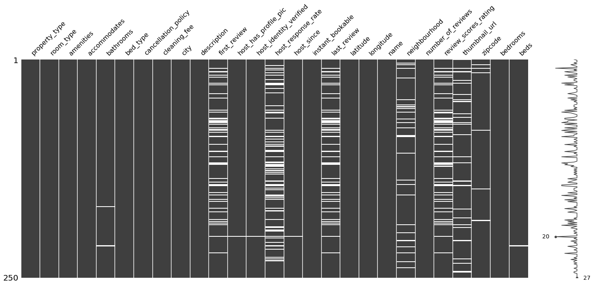

# Predicting prices for Airbnb rentals

<p style="text-align: justify">Platforms to connect landlords and tentants for temporary housing have become a cheap and good alternative to traditional hotel bookings in the tourism industry.</p>
<p style="text-align: justify">Airbnb's business model relies mainly on a fee charged from the total rental price, so it's in their best interest to optimize the prices in order to maximize their revenue. From the point of view of guests, it is benefitial to them to have fair prices that reflect the market and the value of properties. Likewise, hosts don't want to undercharge for the property nor overcharge, because it can reduce the demand.</p>
<p style="text-align: justify">Thus, the question I'm trying to answer is: <b>Can we predict rental prices from features related to the property ?</b></p>

## Loading the data


```python
import pandas as pd
```


```python
df = pd.read_csv("./data/train.csv")
```


```python
df.shape
```


    (74111, 29)


```python
df.columns
```


    Index(['id', 'log_price', 'property_type', 'room_type', 'amenities',
           'accommodates', 'bathrooms', 'bed_type', 'cancellation_policy',
           'cleaning_fee', 'city', 'description', 'first_review',
           'host_has_profile_pic', 'host_identity_verified', 'host_response_rate',
           'host_since', 'instant_bookable', 'last_review', 'latitude',
           'longitude', 'name', 'neighbourhood', 'number_of_reviews',
           'review_scores_rating', 'thumbnail_url', 'zipcode', 'bedrooms', 'beds'],
          dtype='object')


Here, we have a dataset of 74,111 rows and 28 features related to the property, such as location, reviews and rooms. The target variable is the log of the price.

The first thing to do is to separate the target variable from the features. The target column is *log_price*, while all the other columns will be part of the feature dataset, except for the id, which I'll drop now as it is not relevant to the problem (it is a unique number for each row).


```python
X_raw = df.iloc[:,2:]
y = df["log_price"]
```

## Cleaning the data


```python
from sklearn.model_selection import train_test_split
import missingno as msno
from datetime import datetime as dt
import seaborn as sns
from matplotlib import pyplot as plt
```

Before we start fitting models into the data, it is useful to explore the dataset to detect anomalies, handle missing values and preprocess some features.

Let's now see a sample of the first 5 rows of the feature set and a brief description of the main statistics:


```python
pd.set_option("display.max_columns", None)
X_raw.head()
```


<div>
<style scoped>
    .dataframe tbody tr th:only-of-type {
        vertical-align: middle;}
    .dataframe tbody tr th {
        vertical-align: top;}
    .dataframe thead th {
        text-align: right;
    }
</style>
<table border="1" class="dataframe">
  <thead>
    <tr style="text-align: right;">
      <th></th>
      <th>property_type</th>
      <th>room_type</th>
      <th>amenities</th>
      <th>accommodates</th>
      <th>bathrooms</th>
      <th>bed_type</th>
      <th>cancellation_policy</th>
      <th>cleaning_fee</th>
      <th>city</th>
      <th>description</th>
      <th>first_review</th>
      <th>host_has_profile_pic</th>
      <th>host_identity_verified</th>
      <th>host_response_rate</th>
      <th>host_since</th>
      <th>instant_bookable</th>
      <th>last_review</th>
      <th>latitude</th>
      <th>longitude</th>
      <th>name</th>
      <th>neighbourhood</th>
      <th>number_of_reviews</th>
      <th>review_scores_rating</th>
      <th>thumbnail_url</th>
      <th>zipcode</th>
      <th>bedrooms</th>
      <th>beds</th>
    </tr>
  </thead>
  <tbody>
    <tr>
      <th>0</th>
      <td>Apartment</td>
      <td>Entire home/apt</td>
      <td>{"Wireless Internet","Air conditioning",Kitche...</td>
      <td>3</td>
      <td>1.0</td>
      <td>Real Bed</td>
      <td>strict</td>
      <td>True</td>
      <td>NYC</td>
      <td>Beautiful, sunlit brownstone 1-bedroom in the ...</td>
      <td>2016-06-18</td>
      <td>t</td>
      <td>t</td>
      <td>NaN</td>
      <td>2012-03-26</td>
      <td>f</td>
      <td>2016-07-18</td>
      <td>40.696524</td>
      <td>-73.991617</td>
      <td>Beautiful brownstone 1-bedroom</td>
      <td>Brooklyn Heights</td>
      <td>2</td>
      <td>100.0</td>
      <td>https://a0.muscache.com/im/pictures/6d7cbbf7-c...</td>
      <td>11201</td>
      <td>1.0</td>
      <td>1.0</td>
    </tr>
    <tr>
      <th>1</th>
      <td>Apartment</td>
      <td>Entire home/apt</td>
      <td>{"Wireless Internet","Air conditioning",Kitche...</td>
      <td>7</td>
      <td>1.0</td>
      <td>Real Bed</td>
      <td>strict</td>
      <td>True</td>
      <td>NYC</td>
      <td>Enjoy travelling during your stay in Manhattan...</td>
      <td>2017-08-05</td>
      <td>t</td>
      <td>f</td>
      <td>100%</td>
      <td>2017-06-19</td>
      <td>t</td>
      <td>2017-09-23</td>
      <td>40.766115</td>
      <td>-73.989040</td>
      <td>Superb 3BR Apt Located Near Times Square</td>
      <td>Hell's Kitchen</td>
      <td>6</td>
      <td>93.0</td>
      <td>https://a0.muscache.com/im/pictures/348a55fe-4...</td>
      <td>10019</td>
      <td>3.0</td>
      <td>3.0</td>
    </tr>
    <tr>
      <th>2</th>
      <td>Apartment</td>
      <td>Entire home/apt</td>
      <td>{TV,"Cable TV","Wireless Internet","Air condit...</td>
      <td>5</td>
      <td>1.0</td>
      <td>Real Bed</td>
      <td>moderate</td>
      <td>True</td>
      <td>NYC</td>
      <td>The Oasis comes complete with a full backyard ...</td>
      <td>2017-04-30</td>
      <td>t</td>
      <td>t</td>
      <td>100%</td>
      <td>2016-10-25</td>
      <td>t</td>
      <td>2017-09-14</td>
      <td>40.808110</td>
      <td>-73.943756</td>
      <td>The Garden Oasis</td>
      <td>Harlem</td>
      <td>10</td>
      <td>92.0</td>
      <td>https://a0.muscache.com/im/pictures/6fae5362-9...</td>
      <td>10027</td>
      <td>1.0</td>
      <td>3.0</td>
    </tr>
    <tr>
      <th>3</th>
      <td>House</td>
      <td>Entire home/apt</td>
      <td>{TV,"Cable TV",Internet,"Wireless Internet",Ki...</td>
      <td>4</td>
      <td>1.0</td>
      <td>Real Bed</td>
      <td>flexible</td>
      <td>True</td>
      <td>SF</td>
      <td>This light-filled home-away-from-home is super...</td>
      <td>NaN</td>
      <td>t</td>
      <td>t</td>
      <td>NaN</td>
      <td>2015-04-19</td>
      <td>f</td>
      <td>NaN</td>
      <td>37.772004</td>
      <td>-122.431619</td>
      <td>Beautiful Flat in the Heart of SF!</td>
      <td>Lower Haight</td>
      <td>0</td>
      <td>NaN</td>
      <td>https://a0.muscache.com/im/pictures/72208dad-9...</td>
      <td>94117.0</td>
      <td>2.0</td>
      <td>2.0</td>
    </tr>
    <tr>
      <th>4</th>
      <td>Apartment</td>
      <td>Entire home/apt</td>
      <td>{TV,Internet,"Wireless Internet","Air conditio...</td>
      <td>2</td>
      <td>1.0</td>
      <td>Real Bed</td>
      <td>moderate</td>
      <td>True</td>
      <td>DC</td>
      <td>Cool, cozy, and comfortable studio located in ...</td>
      <td>2015-05-12</td>
      <td>t</td>
      <td>t</td>
      <td>100%</td>
      <td>2015-03-01</td>
      <td>t</td>
      <td>2017-01-22</td>
      <td>38.925627</td>
      <td>-77.034596</td>
      <td>Great studio in midtown DC</td>
      <td>Columbia Heights</td>
      <td>4</td>
      <td>40.0</td>
      <td>NaN</td>
      <td>20009</td>
      <td>0.0</td>
      <td>1.0</td>
    </tr>
  </tbody>
</table>
</div>


We can see some missing values in the data. Let's dive deep into this problem.


```python
msno.matrix(X_raw.sample(250))
```


    <matplotlib.axes._subplots.AxesSubplot at 0x188db1133c8>





<p style="text-align: justify">Some columns have a lot of missing values, so it is not reasonable to remove all those rows from the dataset. Also, by dropping those columns we would lose valuable information to the models. Therefore, the approach I'm going to use is to replace the missing values by the string 'NA' if the variable is categorical, or by 0 if the variable is numerical. Besides replacing by 0 in the numerical case, I'll add boolean features that indicate if the row had a missing value or not. After that, for the columns with few missing values, such as <i>bathrooms</i>, <i>zipcode</i> and <i>beds</i>, I'm just going to drop those rows. Finally, I will also drop the column <i>thumbnail_url</i>, as it doesn't provide useful information, the columns <i>zipcode</i>, as the latitude and longitude already provide a geolocation feature and the text variables <i>description</i> and <i>name</i> in order to simplify the problem and avoid NLP techniques that will increase too much the number of features.</p>


```python
X = X_raw.drop(columns=["thumbnail_url", "description", "name", "zipcode"])
X[["first_review_NA", "host_response_rate_NA", "last_review_NA", "review_scores_rating_NA"]] = X_raw[["first_review", "host_response_rate", "last_review", "review_scores_rating"]].fillna("NA").apply(lambda col: col.apply(lambda x: 1 if x=="NA" else 0))
X[["first_review", "last_review", "review_scores_rating"]] = X_raw[["first_review", "last_review", "review_scores_rating"]].fillna(0)
X.neighbourhood = X_raw.neighbourhood.fillna("NA")
X.host_response_rate = X_raw.host_response_rate.fillna("0%")
print(X.shape[0])
X.dropna(inplace=True)
y = y[X.index]
print(X.shape[0])
```

    74111
    73579
    

By replacing missing values by 0, I'm treating true 0 the same as missing values. This may break the linearity of the model for the linear regression, so that's why I chose to add boolean features too. By removing the missing values, our feature dataset has now around 2,000 less rows.

Now, we need to convert some data types that are not the most appropriate for ML training. I'll convert date strings into number of days until a reference date, I'll convert the <i>amenities</i> column into number of amenities, I'll convert all boolean variables to 0 and 1 and <i>host_response_rate</i> to numeric.


```python
today = dt.today()
X.amenities = X.amenities.str.split(",").apply(len)
X[["first_review", "last_review", "host_since"]] = X[["first_review", "last_review", "host_since"]].apply(lambda col: col.apply(lambda x: (today-dt.fromisoformat(x)).days if x!=0 else x))
X.host_response_rate = X.host_response_rate.str.replace("%", "").astype(int)
X[["host_has_profile_pic", "host_identity_verified", "instant_bookable"]] = X[["host_has_profile_pic", "host_identity_verified", "instant_bookable"]].apply(lambda col: col.apply(lambda x: 1 if x == "t" else 0))
X.cleaning_fee = X.cleaning_fee.apply(lambda x: 1 if x==True else 0)
```

Let's now explore the data a little more:


```python
X.describe()
```


<div>
<style scoped>
    .dataframe tbody tr th:only-of-type {
        vertical-align: middle;}
    .dataframe tbody tr th {
        vertical-align: top;}
    .dataframe thead th {
        text-align: right;
    }
</style>
<table border="1" class="dataframe">
  <thead>
    <tr style="text-align: right;">
      <th></th>
      <th>amenities</th>
      <th>accommodates</th>
      <th>bathrooms</th>
      <th>cleaning_fee</th>
      <th>first_review</th>
      <th>host_has_profile_pic</th>
      <th>host_identity_verified</th>
      <th>host_response_rate</th>
      <th>host_since</th>
      <th>instant_bookable</th>
      <th>last_review</th>
      <th>latitude</th>
      <th>longitude</th>
      <th>number_of_reviews</th>
      <th>review_scores_rating</th>
      <th>bedrooms</th>
      <th>beds</th>
      <th>first_review_NA</th>
      <th>host_response_rate_NA</th>
      <th>last_review_NA</th>
      <th>review_scores_rating_NA</th>
    </tr>
  </thead>
  <tbody>
    <tr>
      <th>count</th>
      <td>73579.000000</td>
      <td>73579.000000</td>
      <td>73579.000000</td>
      <td>73579.000000</td>
      <td>73579.000000</td>
      <td>73579.000000</td>
      <td>73579.000000</td>
      <td>73579.000000</td>
      <td>73579.000000</td>
      <td>73579.000000</td>
      <td>73579.000000</td>
      <td>73579.000000</td>
      <td>73579.000000</td>
      <td>73579.000000</td>
      <td>73579.000000</td>
      <td>73579.000000</td>
      <td>73579.000000</td>
      <td>73579.000000</td>
      <td>73579.000000</td>
      <td>73579.000000</td>
      <td>73579.000000</td>
    </tr>
    <tr>
      <th>mean</th>
      <td>17.635331</td>
      <td>3.160888</td>
      <td>1.236039</td>
      <td>0.734884</td>
      <td>1256.618247</td>
      <td>0.996956</td>
      <td>0.673263</td>
      <td>71.252708</td>
      <td>2141.792971</td>
      <td>0.263023</td>
      <td>925.175539</td>
      <td>38.441312</td>
      <td>-92.441681</td>
      <td>20.889425</td>
      <td>72.865437</td>
      <td>1.266802</td>
      <td>1.712975</td>
      <td>0.213920</td>
      <td>0.244920</td>
      <td>0.213498</td>
      <td>0.225472</td>
    </tr>
    <tr>
      <th>std</th>
      <td>6.923991</td>
      <td>2.156297</td>
      <td>0.582947</td>
      <td>0.441398</td>
      <td>786.859603</td>
      <td>0.055092</td>
      <td>0.469023</td>
      <td>42.988835</td>
      <td>659.296636</td>
      <td>0.440278</td>
      <td>523.165589</td>
      <td>3.081897</td>
      <td>21.711043</td>
      <td>37.818332</td>
      <td>39.913863</td>
      <td>0.853585</td>
      <td>1.256094</td>
      <td>0.410074</td>
      <td>0.430043</td>
      <td>0.409779</td>
      <td>0.417896</td>
    </tr>
    <tr>
      <th>min</th>
      <td>1.000000</td>
      <td>1.000000</td>
      <td>0.000000</td>
      <td>0.000000</td>
      <td>0.000000</td>
      <td>0.000000</td>
      <td>0.000000</td>
      <td>0.000000</td>
      <td>974.000000</td>
      <td>0.000000</td>
      <td>0.000000</td>
      <td>33.338905</td>
      <td>-122.511500</td>
      <td>0.000000</td>
      <td>0.000000</td>
      <td>0.000000</td>
      <td>0.000000</td>
      <td>0.000000</td>
      <td>0.000000</td>
      <td>0.000000</td>
      <td>0.000000</td>
    </tr>
    <tr>
      <th>25%</th>
      <td>13.000000</td>
      <td>2.000000</td>
      <td>1.000000</td>
      <td>0.000000</td>
      <td>1027.000000</td>
      <td>1.000000</td>
      <td>0.000000</td>
      <td>0.000000</td>
      <td>1625.000000</td>
      <td>0.000000</td>
      <td>980.000000</td>
      <td>34.126898</td>
      <td>-118.342867</td>
      <td>1.000000</td>
      <td>80.000000</td>
      <td>1.000000</td>
      <td>1.000000</td>
      <td>0.000000</td>
      <td>0.000000</td>
      <td>0.000000</td>
      <td>0.000000</td>
    </tr>
    <tr>
      <th>50%</th>
      <td>17.000000</td>
      <td>2.000000</td>
      <td>1.000000</td>
      <td>1.000000</td>
      <td>1357.000000</td>
      <td>1.000000</td>
      <td>1.000000</td>
      <td>100.000000</td>
      <td>2073.000000</td>
      <td>0.000000</td>
      <td>1047.000000</td>
      <td>40.661481</td>
      <td>-76.998494</td>
      <td>6.000000</td>
      <td>94.000000</td>
      <td>1.000000</td>
      <td>1.000000</td>
      <td>0.000000</td>
      <td>0.000000</td>
      <td>0.000000</td>
      <td>0.000000</td>
    </tr>
    <tr>
      <th>75%</th>
      <td>22.000000</td>
      <td>4.000000</td>
      <td>1.000000</td>
      <td>1.000000</td>
      <td>1717.000000</td>
      <td>1.000000</td>
      <td>1.000000</td>
      <td>100.000000</td>
      <td>2596.000000</td>
      <td>1.000000</td>
      <td>1168.000000</td>
      <td>40.746124</td>
      <td>-73.954688</td>
      <td>23.000000</td>
      <td>99.000000</td>
      <td>1.000000</td>
      <td>2.000000</td>
      <td>0.000000</td>
      <td>0.000000</td>
      <td>0.000000</td>
      <td>0.000000</td>
    </tr>
    <tr>
      <th>max</th>
      <td>86.000000</td>
      <td>16.000000</td>
      <td>8.000000</td>
      <td>1.000000</td>
      <td>4217.000000</td>
      <td>1.000000</td>
      <td>1.000000</td>
      <td>100.000000</td>
      <td>4476.000000</td>
      <td>1.000000</td>
      <td>4152.000000</td>
      <td>42.390437</td>
      <td>-70.985047</td>
      <td>605.000000</td>
      <td>100.000000</td>
      <td>10.000000</td>
      <td>18.000000</td>
      <td>1.000000</td>
      <td>1.000000</td>
      <td>1.000000</td>
      <td>1.000000</td>
    </tr>
  </tbody>
</table>
</div>


There doesn't seem to be any anomalous value for the numeric features. Now, the last thing to do is to convert all categorical variables into one-hot encoding format.


```python
one_hot = pd.get_dummies(X[["property_type", "room_type", "bed_type", "cancellation_policy", "city", "neighbourhood"]], drop_first = True)
X.drop(columns = ["property_type", "room_type", "bed_type", "cancellation_policy", "city", "neighbourhood"], inplace = True)
X[one_hot.columns] = one_hot

print(X.shape)
X.head()
```

    (73579, 688)
    


<div>
<style scoped>
    .dataframe tbody tr th:only-of-type {
        vertical-align: middle;}
    .dataframe tbody tr th {
        vertical-align: top;
    }
    .dataframe thead th {
        text-align: right;
    }
</style>
<table border="1" class="dataframe">
  <thead>
    <tr style="text-align: right;">
      <th></th>
      <th>amenities</th>
      <th>accommodates</th>
      <th>bathrooms</th>
      <th>cleaning_fee</th>
      <th>first_review</th>
      <th>host_has_profile_pic</th>
      <th>host_identity_verified</th>
      <th>host_response_rate</th>
      <th>host_since</th>
      <th>instant_bookable</th>
      <th>last_review</th>
      <th>latitude</th>
      <th>longitude</th>
      <th>number_of_reviews</th>
      <th>review_scores_rating</th>
      <th>bedrooms</th>
      <th>beds</th>
      <th>first_review_NA</th>
      <th>host_response_rate_NA</th>
      <th>last_review_NA</th>
      <th>review_scores_rating_NA</th>
      <th>property_type_Bed &amp; Breakfast</th>
      <th>property_type_Boat</th>
      <th>property_type_Boutique hotel</th>
      <th>property_type_Bungalow</th>
      <th>property_type_Cabin</th>
      <th>property_type_Camper/RV</th>
      <th>property_type_Casa particular</th>
      <th>property_type_Castle</th>
      <th>property_type_Cave</th>
      <th>property_type_Chalet</th>
      <th>property_type_Condominium</th>
      <th>property_type_Dorm</th>
      <th>property_type_Earth House</th>
      <th>property_type_Guest suite</th>
      <th>property_type_Guesthouse</th>
      <th>property_type_Hostel</th>
      <th>property_type_House</th>
      <th>property_type_Hut</th>
      <th>property_type_In-law</th>
      <th>property_type_Island</th>
      <th>property_type_Lighthouse</th>
      <th>property_type_Loft</th>
      <th>property_type_Other</th>
      <th>property_type_Serviced apartment</th>
      <th>property_type_Tent</th>
      <th>property_type_Timeshare</th>
      <th>property_type_Tipi</th>
      <th>property_type_Townhouse</th>
      <th>property_type_Train</th>
      <th>property_type_Treehouse</th>
      <th>property_type_Vacation home</th>
      <th>property_type_Villa</th>
      <th>property_type_Yurt</th>
      <th>room_type_Private room</th>
      <th>room_type_Shared room</th>
      <th>bed_type_Couch</th>
      <th>bed_type_Futon</th>
      <th>bed_type_Pull-out Sofa</th>
      <th>bed_type_Real Bed</th>
      <th>cancellation_policy_moderate</th>
      <th>cancellation_policy_strict</th>
      <th>cancellation_policy_super_strict_30</th>
      <th>cancellation_policy_super_strict_60</th>
      <th>city_Chicago</th>
      <th>city_DC</th>
      <th>city_LA</th>
      <th>city_NYC</th>
      <th>city_SF</th>
      <th>neighbourhood_Adams Morgan</th>
      <th>neighbourhood_Alamo Square</th>
      <th>neighbourhood_Albany Park</th>
      <th>neighbourhood_Alhambra</th>
      <th>neighbourhood_Allerton</th>
      <th>neighbourhood_Allston-Brighton</th>
      <th>neighbourhood_Alondra Park</th>
      <th>neighbourhood_Alphabet City</th>
      <th>neighbourhood_Altadena</th>
      <th>neighbourhood_American University Park</th>
      <th>neighbourhood_Anacostia</th>
      <th>neighbourhood_Andersonville</th>
      <th>neighbourhood_Annadale</th>
      <th>neighbourhood_Arboretum</th>
      <th>neighbourhood_Arcadia</th>
      <th>neighbourhood_Archer Heights</th>
      <th>neighbourhood_Arleta</th>
      <th>neighbourhood_Armour Square</th>
      <th>neighbourhood_Arrochar</th>
      <th>neighbourhood_Artesia</th>
      <th>neighbourhood_Arts District</th>
      <th>neighbourhood_Ashburn</th>
      <th>neighbourhood_Astoria</th>
      <th>neighbourhood_Atwater Village</th>
      <th>neighbourhood_Auburn Gresham</th>
      <th>neighbourhood_Austin</th>
      <th>neighbourhood_Avondale</th>
      <th>neighbourhood_Azusa</th>
      <th>neighbourhood_Back Bay</th>
      <th>neighbourhood_Back of the Yards</th>
      <th>neighbourhood_Balboa Terrace</th>
      <th>neighbourhood_Baldwin Hills</th>
      <th>neighbourhood_Baldwin Park</th>
      <th>neighbourhood_Barney Circle</th>
      <th>neighbourhood_Barry Farm</th>
      <th>neighbourhood_Bath Beach</th>
      <th>neighbourhood_Battery Park City</th>
      <th>neighbourhood_Bay Ridge</th>
      <th>neighbourhood_Baychester</th>
      <th>neighbourhood_Bayside</th>
      <th>neighbourhood_Bayview</th>
      <th>neighbourhood_Beacon Hill</th>
      <th>neighbourhood_Bedford Park</th>
      <th>neighbourhood_Bedford-Stuyvesant</th>
      <th>neighbourhood_Bel Air/Beverly Crest</th>
      <th>neighbourhood_Bell</th>
      <th>neighbourhood_Bellevue</th>
      <th>neighbourhood_Bellflower</th>
      <th>neighbourhood_Belmont</th>
      <th>neighbourhood_Belmont Cragin</th>
      <th>neighbourhood_Benning</th>
      <th>neighbourhood_Benning Heights</th>
      <th>neighbourhood_Benning Ridge</th>
      <th>neighbourhood_Bensonhurst</th>
      <th>neighbourhood_Bergen Beach</th>
      <th>neighbourhood_Berkley</th>
      <th>neighbourhood_Bernal Heights</th>
      <th>neighbourhood_Bethesda, MD</th>
      <th>neighbourhood_Beverly</th>
      <th>neighbourhood_Beverly Hills</th>
      <th>neighbourhood_Bloomingdale</th>
      <th>neighbourhood_Boerum Hill</th>
      <th>neighbourhood_Borough Park</th>
      <th>neighbourhood_Boyle Heights</th>
      <th>neighbourhood_Boystown</th>
      <th>neighbourhood_Bradbury</th>
      <th>neighbourhood_Brentwood</th>
      <th>neighbourhood_Bridgeport</th>
      <th>neighbourhood_Brighton Beach</th>
      <th>neighbourhood_Brighton Park</th>
      <th>neighbourhood_Brightwood</th>
      <th>neighbourhood_Bronxdale</th>
      <th>neighbourhood_Bronzeville</th>
      <th>neighbourhood_Brookland</th>
      <th>neighbourhood_Brookline</th>
      <th>neighbourhood_Brooklyn</th>
      <th>neighbourhood_Brooklyn Heights</th>
      <th>neighbourhood_Brooklyn Navy Yard</th>
      <th>neighbourhood_Brownsville</th>
      <th>neighbourhood_Bucktown</th>
      <th>neighbourhood_Buena Vista</th>
      <th>neighbourhood_Burbank</th>
      <th>neighbourhood_Burleith</th>
      <th>neighbourhood_Bushwick</th>
      <th>neighbourhood_Cahuenga Pass</th>
      <th>neighbourhood_Cambridge</th>
      <th>neighbourhood_Canarsie</th>
      <th>neighbourhood_Canoga Park</th>
      <th>neighbourhood_Capitol Hill</th>
      <th>neighbourhood_Carroll Gardens</th>
      <th>neighbourhood_Carson</th>
      <th>neighbourhood_Carver Langston</th>
      <th>neighbourhood_Castle Hill</th>
      <th>neighbourhood_Castleton Corners</th>
      <th>neighbourhood_Cathedral Heights</th>
      <th>neighbourhood_Central Northeast/Mahaning Heights</th>
      <th>neighbourhood_Cerritos</th>
      <th>neighbourhood_Charlestown</th>
      <th>neighbourhood_Chatham</th>
      <th>neighbourhood_Chatsworth</th>
      <th>neighbourhood_Chelsea</th>
      <th>neighbourhood_Chestnut Hill</th>
      <th>neighbourhood_Chevy Chase</th>
      <th>neighbourhood_Chevy Chase, MD</th>
      <th>neighbourhood_Chillum, MD</th>
      <th>neighbourhood_Chinatown</th>
      <th>neighbourhood_City Island</th>
      <th>neighbourhood_Civic Center</th>
      <th>neighbourhood_Claremont</th>
      <th>neighbourhood_Clearing</th>
      <th>neighbourhood_Cleveland Park</th>
      <th>neighbourhood_Clifton</th>
      <th>neighbourhood_Clinton Hill</th>
      <th>neighbourhood_Co-op City</th>
      <th>neighbourhood_Cobble Hill</th>
      <th>neighbourhood_Cole Valley</th>
      <th>neighbourhood_College Point</th>
      <th>neighbourhood_Colonial Village</th>
      <th>neighbourhood_Columbia Heights</th>
      <th>neighbourhood_Columbia Street Waterfront</th>
      <th>neighbourhood_Commerce</th>
      <th>neighbourhood_Compton</th>
      <th>neighbourhood_Concord</th>
      <th>neighbourhood_Concourse</th>
      <th>neighbourhood_Concourse Village</th>
      <th>neighbourhood_Coney Island</th>
      <th>neighbourhood_Congress Heights</th>
      <th>neighbourhood_Coolidge Corner</th>
      <th>neighbourhood_Corona</th>
      <th>neighbourhood_Country Club</th>
      <th>neighbourhood_Covina</th>
      <th>neighbourhood_Cow Hollow</th>
      <th>neighbourhood_Crestwood</th>
      <th>neighbourhood_Crocker Amazon</th>
      <th>neighbourhood_Crotona</th>
      <th>neighbourhood_Crown Heights</th>
      <th>neighbourhood_Culver City</th>
      <th>neighbourhood_Cypress Park</th>
      <th>neighbourhood_DUMBO</th>
      <th>neighbourhood_Daly City</th>
      <th>neighbourhood_Deanwood</th>
      <th>neighbourhood_Del Rey</th>
      <th>neighbourhood_Diamond Heights</th>
      <th>neighbourhood_Ditmars / Steinway</th>
      <th>neighbourhood_Dogpatch</th>
      <th>neighbourhood_Dongan Hills</th>
      <th>neighbourhood_Dorchester</th>
      <th>neighbourhood_Douglass</th>
      <th>neighbourhood_Downey</th>
      <th>neighbourhood_Downtown</th>
      <th>neighbourhood_Downtown Brooklyn</th>
      <th>neighbourhood_Downtown Crossing</th>
      <th>neighbourhood_Downtown/Penn Quarter</th>
      <th>neighbourhood_Duarte</th>
      <th>neighbourhood_Duboce Triangle</th>
      <th>neighbourhood_Dunning</th>
      <th>neighbourhood_Dupont Circle</th>
      <th>neighbourhood_Dupont Park</th>
      <th>neighbourhood_Dyker Heights</th>
      <th>neighbourhood_Eagle Rock</th>
      <th>neighbourhood_East Boston</th>
      <th>neighbourhood_East Corner</th>
      <th>neighbourhood_East Elmhurst</th>
      <th>neighbourhood_East Flatbush</th>
      <th>neighbourhood_East Harlem</th>
      <th>neighbourhood_East Hollywood</th>
      <th>neighbourhood_East Los Angeles</th>
      <th>neighbourhood_East New York</th>
      <th>neighbourhood_East San Gabriel</th>
      <th>neighbourhood_East Village</th>
      <th>neighbourhood_Eastchester</th>
      <th>neighbourhood_Eastland Gardens</th>
      <th>neighbourhood_Echo Park</th>
      <th>neighbourhood_Eckington</th>
      <th>neighbourhood_Edenwald</th>
      <th>neighbourhood_Edgewater</th>
      <th>neighbourhood_Edgewood</th>
      <th>neighbourhood_Edison Park</th>
      <th>neighbourhood_El Monte</th>
      <th>neighbourhood_El Segundo</th>
      <th>neighbourhood_El Sereno</th>
      <th>neighbourhood_Elm Park</th>
      <th>neighbourhood_Elmhurst</th>
      <th>neighbourhood_Eltingville</th>
      <th>neighbourhood_Elysian Valley</th>
      <th>neighbourhood_Emerson Hill</th>
      <th>neighbourhood_Encino</th>
      <th>neighbourhood_Englewood</th>
      <th>neighbourhood_Excelsior</th>
      <th>neighbourhood_Fairlawn</th>
      <th>neighbourhood_Fenway/Kenmore</th>
      <th>neighbourhood_Financial District</th>
      <th>neighbourhood_Fisherman's Wharf</th>
      <th>neighbourhood_Flatbush</th>
      <th>neighbourhood_Flatiron District</th>
      <th>neighbourhood_Flatlands</th>
      <th>neighbourhood_Florence-Graham</th>
      <th>neighbourhood_Flushing</th>
      <th>neighbourhood_Foggy Bottom</th>
      <th>neighbourhood_Fordham</th>
      <th>neighbourhood_Forest Hill</th>
      <th>neighbourhood_Forest Hills</th>
      <th>neighbourhood_Fort Davis</th>
      <th>neighbourhood_Fort Dupont</th>
      <th>neighbourhood_Fort Greene</th>
      <th>neighbourhood_Fort Lincoln</th>
      <th>neighbourhood_Fort Totten</th>
      <th>neighbourhood_Fort Wadsworth</th>
      <th>neighbourhood_Foxhall</th>
      <th>neighbourhood_Fresh Meadows</th>
      <th>neighbourhood_Friendship Heights</th>
      <th>neighbourhood_Galewood</th>
      <th>neighbourhood_Gallaudet</th>
      <th>neighbourhood_Gardena</th>
      <th>neighbourhood_Garfield Heights</th>
      <th>neighbourhood_Garfield Park</th>
      <th>neighbourhood_Garfield Ridge</th>
      <th>neighbourhood_Gateway</th>
      <th>neighbourhood_Georgetown</th>
      <th>neighbourhood_Gerritsen Beach</th>
      <th>neighbourhood_Glassell Park</th>
      <th>neighbourhood_Glen Park</th>
      <th>neighbourhood_Glendale</th>
      <th>neighbourhood_Glendora</th>
      <th>neighbourhood_Glover Park</th>
      <th>neighbourhood_Gold Coast</th>
      <th>neighbourhood_Good Hope</th>
      <th>neighbourhood_Government Center</th>
      <th>neighbourhood_Gowanus</th>
      <th>neighbourhood_Gramercy Park</th>
      <th>neighbourhood_Granada Hills North</th>
      <th>neighbourhood_Grand Crossing</th>
      <th>neighbourhood_Graniteville</th>
      <th>neighbourhood_Grant City</th>
      <th>neighbourhood_Grasmere</th>
      <th>neighbourhood_Gravesend</th>
      <th>neighbourhood_Great Kills</th>
      <th>neighbourhood_Greenpoint</th>
      <th>neighbourhood_Greenway</th>
      <th>neighbourhood_Greenwich Village</th>
      <th>neighbourhood_Greenwood Heights</th>
      <th>neighbourhood_Grymes Hill</th>
      <th>neighbourhood_Haight-Ashbury</th>
      <th>neighbourhood_Hamilton Heights</th>
      <th>neighbourhood_Harbor City</th>
      <th>neighbourhood_Harbor Gateway</th>
      <th>neighbourhood_Harlem</th>
      <th>neighbourhood_Harvard Square</th>
      <th>neighbourhood_Hawaiian Gardens</th>
      <th>neighbourhood_Hawthorne</th>
      <th>neighbourhood_Hayes Valley</th>
      <th>neighbourhood_Hell's Kitchen</th>
      <th>neighbourhood_Hermon</th>
      <th>neighbourhood_Hermosa</th>
      <th>neighbourhood_Hermosa Beach</th>
      <th>neighbourhood_Highbridge</th>
      <th>neighbourhood_Highland Park</th>
      <th>neighbourhood_Hilcrest Heights/Marlow Heights, MD</th>
      <th>neighbourhood_Hillbrook</th>
      <th>neighbourhood_Hillcrest</th>
      <th>neighbourhood_Hollywood</th>
      <th>neighbourhood_Hollywood Hills</th>
      <th>neighbourhood_Howard Beach</th>
      <th>neighbourhood_Hudson Square</th>
      <th>neighbourhood_Huguenot</th>
      <th>neighbourhood_Humboldt Park</th>
      <th>neighbourhood_Huntington Park</th>
      <th>neighbourhood_Hunts Point</th>
      <th>neighbourhood_Hyde Park</th>
      <th>neighbourhood_Ingleside</th>
      <th>neighbourhood_Inglewood</th>
      <th>neighbourhood_Inner Sunset</th>
      <th>neighbourhood_Inwood</th>
      <th>neighbourhood_Irving Park</th>
      <th>neighbourhood_Irwindale</th>
      <th>neighbourhood_Ivy City</th>
      <th>neighbourhood_Jackson Heights</th>
      <th>neighbourhood_Jamaica</th>
      <th>neighbourhood_Jamaica Plain</th>
      <th>neighbourhood_Japantown</th>
      <th>neighbourhood_Jefferson Park</th>
      <th>neighbourhood_Judiciary Square</th>
      <th>neighbourhood_Kalorama</th>
      <th>neighbourhood_Kensington</th>
      <th>neighbourhood_Kent</th>
      <th>neighbourhood_Kenwood</th>
      <th>neighbourhood_Kew Garden Hills</th>
      <th>neighbourhood_Kingman Park</th>
      <th>neighbourhood_Kingsbridge</th>
      <th>neighbourhood_Kingsbridge Heights</th>
      <th>neighbourhood_Kips Bay</th>
      <th>neighbourhood_La Canada Flintridge</th>
      <th>neighbourhood_La Crescenta-Montrose</th>
      <th>neighbourhood_La Habra</th>
      <th>neighbourhood_La Mirada</th>
      <th>neighbourhood_La Puente</th>
      <th>neighbourhood_Lake Balboa</th>
      <th>neighbourhood_Lakeshore</th>
      <th>neighbourhood_Lakeview</th>
      <th>neighbourhood_Lakewood</th>
      <th>neighbourhood_Lamond Riggs</th>
      <th>neighbourhood_Langdon</th>
      <th>neighbourhood_Laurel Canyon</th>
      <th>neighbourhood_Lawndale</th>
      <th>neighbourhood_LeDroit Park</th>
      <th>neighbourhood_Leather District</th>
      <th>neighbourhood_Lefferts Garden</th>
      <th>neighbourhood_Lighthouse HIll</th>
      <th>neighbourhood_Lincoln Heights</th>
      <th>neighbourhood_Lincoln Park</th>
      <th>neighbourhood_Lincoln Square</th>
      <th>neighbourhood_Lindenwood</th>
      <th>neighbourhood_Little Italy</th>
      <th>neighbourhood_Little Italy/UIC</th>
      <th>neighbourhood_Little Village</th>
      <th>neighbourhood_Logan Circle</th>
      <th>neighbourhood_Logan Square</th>
      <th>neighbourhood_Lomita</th>
      <th>neighbourhood_Long Beach</th>
      <th>neighbourhood_Long Island City</th>
      <th>neighbourhood_Longwood</th>
      <th>neighbourhood_Loop</th>
      <th>neighbourhood_Los Feliz</th>
      <th>neighbourhood_Lower East Side</th>
      <th>neighbourhood_Lower Haight</th>
      <th>neighbourhood_Lynwood</th>
      <th>neighbourhood_Magnificent Mile</th>
      <th>neighbourhood_Malibu</th>
      <th>neighbourhood_Manhattan</th>
      <th>neighbourhood_Manhattan Beach</th>
      <th>neighbourhood_Manor Park</th>
      <th>neighbourhood_Mar Vista</th>
      <th>neighbourhood_Marble Hill</th>
      <th>neighbourhood_Marina</th>
      <th>neighbourhood_Marina Del Rey</th>
      <th>neighbourhood_Marine Park</th>
      <th>neighbourhood_Mariners Harbor</th>
      <th>neighbourhood_Marshall Heights</th>
      <th>neighbourhood_Maspeth</th>
      <th>neighbourhood_Massachusetts Heights</th>
      <th>neighbourhood_Mattapan</th>
      <th>neighbourhood_McKinley Park</th>
      <th>neighbourhood_Meatpacking District</th>
      <th>neighbourhood_Meiers Corners</th>
      <th>neighbourhood_Melrose</th>
      <th>neighbourhood_Michigan Park</th>
      <th>neighbourhood_Mid-City</th>
      <th>neighbourhood_Mid-Wilshire</th>
      <th>neighbourhood_Middle Village</th>
      <th>neighbourhood_Midland Beach</th>
      <th>neighbourhood_Midtown</th>
      <th>neighbourhood_Midtown East</th>
      <th>neighbourhood_Midwood</th>
      <th>neighbourhood_Mill Basin</th>
      <th>neighbourhood_Mission Bay</th>
      <th>neighbourhood_Mission District</th>
      <th>neighbourhood_Mission Hill</th>
      <th>neighbourhood_Mission Hills</th>
      <th>neighbourhood_Mission Terrace</th>
      <th>neighbourhood_Monrovia</th>
      <th>neighbourhood_Montclare</th>
      <th>neighbourhood_Montebello</th>
      <th>neighbourhood_Montecito Heights</th>
      <th>neighbourhood_Monterey Hills</th>
      <th>neighbourhood_Monterey Park</th>
      <th>neighbourhood_Morgan Park</th>
      <th>neighbourhood_Morningside Heights</th>
      <th>neighbourhood_Morris Heights</th>
      <th>neighbourhood_Morris Park</th>
      <th>neighbourhood_Morrisania</th>
      <th>neighbourhood_Mott Haven</th>
      <th>neighbourhood_Mount Eden</th>
      <th>neighbourhood_Mount Pleasant</th>
      <th>neighbourhood_Mount Vernon Square</th>
      <th>neighbourhood_Mount Washington</th>
      <th>neighbourhood_Mt Rainier/Brentwood, MD</th>
      <th>neighbourhood_Mt. Pleasant</th>
      <th>neighbourhood_Mt. Vernon Square</th>
      <th>neighbourhood_Murray Hill</th>
      <th>neighbourhood_NA</th>
      <th>neighbourhood_Navy Yard</th>
      <th>neighbourhood_Naylor Gardens</th>
      <th>neighbourhood_Near North Side</th>
      <th>neighbourhood_Near Northeast</th>
      <th>neighbourhood_Near Northeast/H Street Corridor</th>
      <th>neighbourhood_Near West Side</th>
      <th>neighbourhood_New Brighton</th>
      <th>neighbourhood_New Dorp Beach</th>
      <th>neighbourhood_New Springville</th>
      <th>neighbourhood_Newton</th>
      <th>neighbourhood_Nob Hill</th>
      <th>neighbourhood_Noe Valley</th>
      <th>neighbourhood_Noho</th>
      <th>neighbourhood_Nolita</th>
      <th>neighbourhood_North Beach</th>
      <th>neighbourhood_North Center</th>
      <th>neighbourhood_North Cleveland Park</th>
      <th>neighbourhood_North End</th>
      <th>neighbourhood_North Hills East</th>
      <th>neighbourhood_North Hills West</th>
      <th>neighbourhood_North Hollywood</th>
      <th>neighbourhood_North Lawndale</th>
      <th>neighbourhood_North Michigan Park</th>
      <th>neighbourhood_North Park</th>
      <th>neighbourhood_Northridge</th>
      <th>neighbourhood_Norwalk</th>
      <th>neighbourhood_Norwood</th>
      <th>neighbourhood_Norwood Park</th>
      <th>neighbourhood_O'Hare</th>
      <th>neighbourhood_Oakland</th>
      <th>neighbourhood_Oakwood</th>
      <th>neighbourhood_Observatory Circle</th>
      <th>neighbourhood_Oceanview</th>
      <th>neighbourhood_Old Soldiers' Home</th>
      <th>neighbourhood_Old Town</th>
      <th>neighbourhood_Outer Sunset</th>
      <th>neighbourhood_Ozone Park</th>
      <th>neighbourhood_Pacific Heights</th>
      <th>neighbourhood_Pacific Palisades</th>
      <th>neighbourhood_Pacoima</th>
      <th>neighbourhood_Palisades</th>
      <th>neighbourhood_Palms</th>
      <th>neighbourhood_Palos Verdes</th>
      <th>neighbourhood_Panorama City</th>
      <th>neighbourhood_Paramount</th>
      <th>neighbourhood_Park Slope</th>
      <th>neighbourhood_Park Versailles</th>
      <th>neighbourhood_Park View</th>
      <th>neighbourhood_Parkchester</th>
      <th>neighbourhood_Parkside</th>
      <th>neighbourhood_Pasadena</th>
      <th>neighbourhood_Pelham Bay</th>
      <th>neighbourhood_Petworth</th>
      <th>neighbourhood_Pico Rivera</th>
      <th>neighbourhood_Pilsen</th>
      <th>neighbourhood_Pleasant Hill</th>
      <th>neighbourhood_Pleasant Plains</th>
      <th>neighbourhood_Port Morris</th>
      <th>neighbourhood_Port Richmond</th>
      <th>neighbourhood_Portage Park</th>
      <th>neighbourhood_Porter Ranch</th>
      <th>neighbourhood_Portola</th>
      <th>neighbourhood_Potrero Hill</th>
      <th>neighbourhood_Presidio</th>
      <th>neighbourhood_Presidio Heights</th>
      <th>neighbourhood_Printers Row</th>
      <th>neighbourhood_Prospect Heights</th>
      <th>neighbourhood_Pullman</th>
      <th>neighbourhood_Queens</th>
      <th>neighbourhood_Rancho Palos Verdes</th>
      <th>neighbourhood_Randall Manor</th>
      <th>neighbourhood_Randle Highlands</th>
      <th>neighbourhood_Red Hook</th>
      <th>neighbourhood_Redondo Beach</th>
      <th>neighbourhood_Rego Park</th>
      <th>neighbourhood_Reseda</th>
      <th>neighbourhood_Richmond District</th>
      <th>neighbourhood_Richmond Hill</th>
      <th>neighbourhood_Ridgewood</th>
      <th>neighbourhood_River North</th>
      <th>neighbourhood_River Terrace</th>
      <th>neighbourhood_River West</th>
      <th>neighbourhood_Riverdale</th>
      <th>neighbourhood_Rogers Park</th>
      <th>neighbourhood_Rolling Hills</th>
      <th>neighbourhood_Rolling Hills Estates</th>
      <th>neighbourhood_Roosevelt Island</th>
      <th>neighbourhood_Roscoe Village</th>
      <th>neighbourhood_Rosebank</th>
      <th>neighbourhood_Roseland</th>
      <th>neighbourhood_Rosemead</th>
      <th>neighbourhood_Roslindale</th>
      <th>neighbourhood_Rossville</th>
      <th>neighbourhood_Roxbury</th>
      <th>neighbourhood_Russian Hill</th>
      <th>neighbourhood_San Gabriel</th>
      <th>neighbourhood_San Marino</th>
      <th>neighbourhood_San Pedro</th>
      <th>neighbourhood_Santa Fe Springs</th>
      <th>neighbourhood_Santa Monica</th>
      <th>neighbourhood_Sea Cliff</th>
      <th>neighbourhood_Sea Gate</th>
      <th>neighbourhood_Shaw</th>
      <th>neighbourhood_Sheepshead Bay</th>
      <th>neighbourhood_Shepherd Park</th>
      <th>neighbourhood_Sherman Oaks</th>
      <th>neighbourhood_Shipley Terrace</th>
      <th>neighbourhood_Sierra Madre</th>
      <th>neighbourhood_Signal Hill</th>
      <th>neighbourhood_Silver Lake</th>
      <th>neighbourhood_Silver Spring, MD</th>
      <th>neighbourhood_Skid Row</th>
      <th>neighbourhood_Skyland</th>
      <th>neighbourhood_SoMa</th>
      <th>neighbourhood_Soho</th>
      <th>neighbourhood_Somerville</th>
      <th>neighbourhood_Soundview</th>
      <th>neighbourhood_South Beach</th>
      <th>neighbourhood_South Boston</th>
      <th>neighbourhood_South Chicago</th>
      <th>neighbourhood_South El Monte</th>
      <th>neighbourhood_South End</th>
      <th>neighbourhood_South Gate</th>
      <th>neighbourhood_South LA</th>
      <th>neighbourhood_South Loop/Printers Row</th>
      <th>neighbourhood_South Ozone Park</th>
      <th>neighbourhood_South Pasadena</th>
      <th>neighbourhood_South Robertson</th>
      <th>neighbourhood_South San Gabriel</th>
      <th>neighbourhood_South Shore</th>
      <th>neighbourhood_South Street Seaport</th>
      <th>neighbourhood_South Whittier</th>
      <th>neighbourhood_Southwest Waterfront</th>
      <th>neighbourhood_Spring Valley</th>
      <th>neighbourhood_Spuyten Duyvil</th>
      <th>neighbourhood_St. Elizabeths</th>
      <th>neighbourhood_St. George</th>
      <th>neighbourhood_Stapleton</th>
      <th>neighbourhood_Streeterville</th>
      <th>neighbourhood_Stronghold</th>
      <th>neighbourhood_Studio City</th>
      <th>neighbourhood_Suitland-Silver Hill, MD</th>
      <th>neighbourhood_Sun Valley</th>
      <th>neighbourhood_Sunland/Tujunga</th>
      <th>neighbourhood_Sunnyside</th>
      <th>neighbourhood_Sunset Park</th>
      <th>neighbourhood_Sylmar</th>
      <th>neighbourhood_Takoma</th>
      <th>neighbourhood_Takoma Park, MD</th>
      <th>neighbourhood_Tarzana</th>
      <th>neighbourhood_Telegraph Hill</th>
      <th>neighbourhood_Temple City</th>
      <th>neighbourhood_Tenderloin</th>
      <th>neighbourhood_The Bronx</th>
      <th>neighbourhood_The Castro</th>
      <th>neighbourhood_The Rockaways</th>
      <th>neighbourhood_Theater District</th>
      <th>neighbourhood_Throgs Neck</th>
      <th>neighbourhood_Times Square/Theatre District</th>
      <th>neighbourhood_Todt Hill</th>
      <th>neighbourhood_Toluca Lake</th>
      <th>neighbourhood_Tompkinsville</th>
      <th>neighbourhood_Topanga</th>
      <th>neighbourhood_Torrance</th>
      <th>neighbourhood_Tottenville</th>
      <th>neighbourhood_Tremont</th>
      <th>neighbourhood_Tribeca</th>
      <th>neighbourhood_Trinidad</th>
      <th>neighbourhood_Truxton Circle</th>
      <th>neighbourhood_Twin Peaks</th>
      <th>neighbourhood_Twining</th>
      <th>neighbourhood_U Street Corridor</th>
      <th>neighbourhood_Ukrainian Village</th>
      <th>neighbourhood_Union Square</th>
      <th>neighbourhood_University Heights</th>
      <th>neighbourhood_Upper East Side</th>
      <th>neighbourhood_Upper West Side</th>
      <th>neighbourhood_Uptown</th>
      <th>neighbourhood_Utopia</th>
      <th>neighbourhood_Valley Glen</th>
      <th>neighbourhood_Valley Village</th>
      <th>neighbourhood_Van Nest</th>
      <th>neighbourhood_Van Nuys</th>
      <th>neighbourhood_Venice</th>
      <th>neighbourhood_Vernon</th>
      <th>neighbourhood_Vinegar Hill</th>
      <th>neighbourhood_Visitacion Valley</th>
      <th>neighbourhood_Wakefield</th>
      <th>neighbourhood_Washington Heights</th>
      <th>neighbourhood_Washington Highlands</th>
      <th>neighbourhood_Washington Park</th>
      <th>neighbourhood_Watertown</th>
      <th>neighbourhood_Watts</th>
      <th>neighbourhood_Wesley Heights</th>
      <th>neighbourhood_West Adams</th>
      <th>neighbourhood_West Athens</th>
      <th>neighbourhood_West Brighton</th>
      <th>neighbourhood_West Covina</th>
      <th>neighbourhood_West Elsdon</th>
      <th>neighbourhood_West End</th>
      <th>neighbourhood_West Farms</th>
      <th>neighbourhood_West Hills</th>
      <th>neighbourhood_West Hollywood</th>
      <th>neighbourhood_West Lawn</th>
      <th>neighbourhood_West Loop/Greektown</th>
      <th>neighbourhood_West Los Angeles</th>
      <th>neighbourhood_West Portal</th>
      <th>neighbourhood_West Puente Valley</th>
      <th>neighbourhood_West Ridge</th>
      <th>neighbourhood_West Roxbury</th>
      <th>neighbourhood_West Town</th>
      <th>neighbourhood_West Town/Noble Square</th>
      <th>neighbourhood_West Village</th>
      <th>neighbourhood_Westchester Village</th>
      <th>neighbourhood_Westchester/Playa Del Rey</th>
      <th>neighbourhood_Westerleigh</th>
      <th>neighbourhood_Western Addition/NOPA</th>
      <th>neighbourhood_Westlake</th>
      <th>neighbourhood_Westmont</th>
      <th>neighbourhood_Westside</th>
      <th>neighbourhood_Westwood</th>
      <th>neighbourhood_Whitestone</th>
      <th>neighbourhood_Whittier</th>
      <th>neighbourhood_Wicker Park</th>
      <th>neighbourhood_Williamsbridge</th>
      <th>neighbourhood_Williamsburg</th>
      <th>neighbourhood_Willowbrook</th>
      <th>neighbourhood_Wilmington</th>
      <th>neighbourhood_Windsor Terrace</th>
      <th>neighbourhood_Winnetka</th>
      <th>neighbourhood_Winthrop</th>
      <th>neighbourhood_Woodhaven</th>
      <th>neighbourhood_Woodland</th>
      <th>neighbourhood_Woodland Hills/Warner Center</th>
      <th>neighbourhood_Woodlawn</th>
      <th>neighbourhood_Woodley Park</th>
      <th>neighbourhood_Woodridge</th>
      <th>neighbourhood_Woodside</th>
      <th>neighbourhood_Wrigleyville</th>
    </tr>
  </thead>
  <tbody>
    <tr>
      <th>0</th>
      <td>9</td>
      <td>3</td>
      <td>1.0</td>
      <td>1</td>
      <td>1447</td>
      <td>1</td>
      <td>1</td>
      <td>0</td>
      <td>2992</td>
      <td>0</td>
      <td>1417</td>
      <td>40.696524</td>
      <td>-73.991617</td>
      <td>2</td>
      <td>100.0</td>
      <td>1.0</td>
      <td>1.0</td>
      <td>0</td>
      <td>1</td>
      <td>0</td>
      <td>0</td>
      <td>0</td>
      <td>0</td>
      <td>0</td>
      <td>0</td>
      <td>0</td>
      <td>0</td>
      <td>0</td>
      <td>0</td>
      <td>0</td>
      <td>0</td>
      <td>0</td>
      <td>0</td>
      <td>0</td>
      <td>0</td>
      <td>0</td>
      <td>0</td>
      <td>0</td>
      <td>0</td>
      <td>0</td>
      <td>0</td>
      <td>0</td>
      <td>0</td>
      <td>0</td>
      <td>0</td>
      <td>0</td>
      <td>0</td>
      <td>0</td>
      <td>0</td>
      <td>0</td>
      <td>0</td>
      <td>0</td>
      <td>0</td>
      <td>0</td>
      <td>0</td>
      <td>0</td>
      <td>0</td>
      <td>0</td>
      <td>0</td>
      <td>1</td>
      <td>0</td>
      <td>1</td>
      <td>0</td>
      <td>0</td>
      <td>0</td>
      <td>0</td>
      <td>0</td>
      <td>1</td>
      <td>0</td>
      <td>0</td>
      <td>0</td>
      <td>0</td>
      <td>0</td>
      <td>0</td>
      <td>0</td>
      <td>0</td>
      <td>0</td>
      <td>0</td>
      <td>0</td>
      <td>0</td>
      <td>0</td>
      <td>0</td>
      <td>0</td>
      <td>0</td>
      <td>0</td>
      <td>0</td>
      <td>0</td>
      <td>0</td>
      <td>0</td>
      <td>0</td>
      <td>0</td>
      <td>0</td>
      <td>0</td>
      <td>0</td>
      <td>0</td>
      <td>0</td>
      <td>0</td>
      <td>0</td>
      <td>0</td>
      <td>0</td>
      <td>0</td>
      <td>0</td>
      <td>0</td>
      <td>0</td>
      <td>0</td>
      <td>0</td>
      <td>0</td>
      <td>0</td>
      <td>0</td>
      <td>0</td>
      <td>0</td>
      <td>0</td>
      <td>0</td>
      <td>0</td>
      <td>0</td>
      <td>0</td>
      <td>0</td>
      <td>0</td>
      <td>0</td>
      <td>0</td>
      <td>0</td>
      <td>0</td>
      <td>0</td>
      <td>0</td>
      <td>0</td>
      <td>0</td>
      <td>0</td>
      <td>0</td>
      <td>0</td>
      <td>0</td>
      <td>0</td>
      <td>0</td>
      <td>0</td>
      <td>0</td>
      <td>0</td>
      <td>0</td>
      <td>0</td>
      <td>0</td>
      <td>0</td>
      <td>0</td>
      <td>0</td>
      <td>0</td>
      <td>0</td>
      <td>0</td>
      <td>0</td>
      <td>1</td>
      <td>0</td>
      <td>0</td>
      <td>0</td>
      <td>0</td>
      <td>0</td>
      <td>0</td>
      <td>0</td>
      <td>0</td>
      <td>0</td>
      <td>0</td>
      <td>0</td>
      <td>0</td>
      <td>0</td>
      <td>0</td>
      <td>0</td>
      <td>0</td>
      <td>0</td>
      <td>0</td>
      <td>0</td>
      <td>0</td>
      <td>0</td>
      <td>0</td>
      <td>0</td>
      <td>0</td>
      <td>0</td>
      <td>0</td>
      <td>0</td>
      <td>0</td>
      <td>0</td>
      <td>0</td>
      <td>0</td>
      <td>0</td>
      <td>0</td>
      <td>0</td>
      <td>0</td>
      <td>0</td>
      <td>0</td>
      <td>0</td>
      <td>0</td>
      <td>0</td>
      <td>0</td>
      <td>0</td>
      <td>0</td>
      <td>0</td>
      <td>0</td>
      <td>0</td>
      <td>0</td>
      <td>0</td>
      <td>0</td>
      <td>0</td>
      <td>0</td>
      <td>0</td>
      <td>0</td>
      <td>0</td>
      <td>0</td>
      <td>0</td>
      <td>0</td>
      <td>0</td>
      <td>0</td>
      <td>0</td>
      <td>0</td>
      <td>0</td>
      <td>0</td>
      <td>0</td>
      <td>0</td>
      <td>0</td>
      <td>0</td>
      <td>0</td>
      <td>0</td>
      <td>0</td>
      <td>0</td>
      <td>0</td>
      <td>0</td>
      <td>0</td>
      <td>0</td>
      <td>0</td>
      <td>0</td>
      <td>0</td>
      <td>0</td>
      <td>0</td>
      <td>0</td>
      <td>0</td>
      <td>0</td>
      <td>0</td>
      <td>0</td>
      <td>0</td>
      <td>0</td>
      <td>0</td>
      <td>0</td>
      <td>0</td>
      <td>0</td>
      <td>0</td>
      <td>0</td>
      <td>0</td>
      <td>0</td>
      <td>0</td>
      <td>0</td>
      <td>0</td>
      <td>0</td>
      <td>0</td>
      <td>0</td>
      <td>0</td>
      <td>0</td>
      <td>0</td>
      <td>0</td>
      <td>0</td>
      <td>0</td>
      <td>0</td>
      <td>0</td>
      <td>0</td>
      <td>0</td>
      <td>0</td>
      <td>0</td>
      <td>0</td>
      <td>0</td>
      <td>0</td>
      <td>0</td>
      <td>0</td>
      <td>0</td>
      <td>0</td>
      <td>0</td>
      <td>0</td>
      <td>0</td>
      <td>0</td>
      <td>0</td>
      <td>0</td>
      <td>0</td>
      <td>0</td>
      <td>0</td>
      <td>0</td>
      <td>0</td>
      <td>0</td>
      <td>0</td>
      <td>0</td>
      <td>0</td>
      <td>0</td>
      <td>0</td>
      <td>0</td>
      <td>0</td>
      <td>0</td>
      <td>0</td>
      <td>0</td>
      <td>0</td>
      <td>0</td>
      <td>0</td>
      <td>0</td>
      <td>0</td>
      <td>0</td>
      <td>0</td>
      <td>0</td>
      <td>0</td>
      <td>0</td>
      <td>0</td>
      <td>0</td>
      <td>0</td>
      <td>0</td>
      <td>0</td>
      <td>0</td>
      <td>0</td>
      <td>0</td>
      <td>0</td>
      <td>0</td>
      <td>0</td>
      <td>0</td>
      <td>0</td>
      <td>0</td>
      <td>0</td>
      <td>0</td>
      <td>0</td>
      <td>0</td>
      <td>0</td>
      <td>0</td>
      <td>0</td>
      <td>0</td>
      <td>0</td>
      <td>0</td>
      <td>0</td>
      <td>0</td>
      <td>0</td>
      <td>0</td>
      <td>0</td>
      <td>0</td>
      <td>0</td>
      <td>0</td>
      <td>0</td>
      <td>0</td>
      <td>0</td>
      <td>0</td>
      <td>0</td>
      <td>0</td>
      <td>0</td>
      <td>0</td>
      <td>0</td>
      <td>0</td>
      <td>0</td>
      <td>0</td>
      <td>0</td>
      <td>0</td>
      <td>0</td>
      <td>0</td>
      <td>0</td>
      <td>0</td>
      <td>0</td>
      <td>0</td>
      <td>0</td>
      <td>0</td>
      <td>0</td>
      <td>0</td>
      <td>0</td>
      <td>0</td>
      <td>0</td>
      <td>0</td>
      <td>0</td>
      <td>0</td>
      <td>0</td>
      <td>0</td>
      <td>0</td>
      <td>0</td>
      <td>0</td>
      <td>0</td>
      <td>0</td>
      <td>0</td>
      <td>0</td>
      <td>0</td>
      <td>0</td>
      <td>0</td>
      <td>0</td>
      <td>0</td>
      <td>0</td>
      <td>0</td>
      <td>0</td>
      <td>0</td>
      <td>0</td>
      <td>0</td>
      <td>0</td>
      <td>0</td>
      <td>0</td>
      <td>0</td>
      <td>0</td>
      <td>0</td>
      <td>0</td>
      <td>0</td>
      <td>0</td>
      <td>0</td>
      <td>0</td>
      <td>0</td>
      <td>0</td>
      <td>0</td>
      <td>0</td>
      <td>0</td>
      <td>0</td>
      <td>0</td>
      <td>0</td>
      <td>0</td>
      <td>0</td>
      <td>0</td>
      <td>0</td>
      <td>0</td>
      <td>0</td>
      <td>0</td>
      <td>0</td>
      <td>0</td>
      <td>0</td>
      <td>0</td>
      <td>0</td>
      <td>0</td>
      <td>0</td>
      <td>0</td>
      <td>0</td>
      <td>0</td>
      <td>0</td>
      <td>0</td>
      <td>0</td>
      <td>0</td>
      <td>0</td>
      <td>0</td>
      <td>0</td>
      <td>0</td>
      <td>0</td>
      <td>0</td>
      <td>0</td>
      <td>0</td>
      <td>0</td>
      <td>0</td>
      <td>0</td>
      <td>0</td>
      <td>0</td>
      <td>0</td>
      <td>0</td>
      <td>0</td>
      <td>0</td>
      <td>0</td>
      <td>0</td>
      <td>0</td>
      <td>0</td>
      <td>0</td>
      <td>0</td>
      <td>0</td>
      <td>0</td>
      <td>0</td>
      <td>0</td>
      <td>0</td>
      <td>0</td>
      <td>0</td>
      <td>0</td>
      <td>0</td>
      <td>0</td>
      <td>0</td>
      <td>0</td>
      <td>0</td>
      <td>0</td>
      <td>0</td>
      <td>0</td>
      <td>0</td>
      <td>0</td>
      <td>0</td>
      <td>0</td>
      <td>0</td>
      <td>0</td>
      <td>0</td>
      <td>0</td>
      <td>0</td>
      <td>0</td>
      <td>0</td>
      <td>0</td>
      <td>0</td>
      <td>0</td>
      <td>0</td>
      <td>0</td>
      <td>0</td>
      <td>0</td>
      <td>0</td>
      <td>0</td>
      <td>0</td>
      <td>0</td>
      <td>0</td>
      <td>0</td>
      <td>0</td>
      <td>0</td>
      <td>0</td>
      <td>0</td>
      <td>0</td>
      <td>0</td>
      <td>0</td>
      <td>0</td>
      <td>0</td>
      <td>0</td>
      <td>0</td>
      <td>0</td>
      <td>0</td>
      <td>0</td>
      <td>0</td>
      <td>0</td>
      <td>0</td>
      <td>0</td>
      <td>0</td>
      <td>0</td>
      <td>0</td>
      <td>0</td>
      <td>0</td>
      <td>0</td>
      <td>0</td>
      <td>0</td>
      <td>0</td>
      <td>0</td>
      <td>0</td>
      <td>0</td>
      <td>0</td>
      <td>0</td>
      <td>0</td>
      <td>0</td>
      <td>0</td>
      <td>0</td>
      <td>0</td>
      <td>0</td>
      <td>0</td>
      <td>0</td>
      <td>0</td>
      <td>0</td>
      <td>0</td>
      <td>0</td>
      <td>0</td>
      <td>0</td>
      <td>0</td>
      <td>0</td>
      <td>0</td>
      <td>0</td>
      <td>0</td>
      <td>0</td>
      <td>0</td>
      <td>0</td>
      <td>0</td>
      <td>0</td>
      <td>0</td>
      <td>0</td>
      <td>0</td>
      <td>0</td>
      <td>0</td>
      <td>0</td>
      <td>0</td>
      <td>0</td>
      <td>0</td>
      <td>0</td>
      <td>0</td>
      <td>0</td>
      <td>0</td>
      <td>0</td>
      <td>0</td>
      <td>0</td>
      <td>0</td>
      <td>0</td>
      <td>0</td>
      <td>0</td>
      <td>0</td>
      <td>0</td>
      <td>0</td>
      <td>0</td>
      <td>0</td>
      <td>0</td>
      <td>0</td>
      <td>0</td>
      <td>0</td>
      <td>0</td>
      <td>0</td>
      <td>0</td>
      <td>0</td>
      <td>0</td>
      <td>0</td>
      <td>0</td>
      <td>0</td>
      <td>0</td>
      <td>0</td>
      <td>0</td>
      <td>0</td>
      <td>0</td>
      <td>0</td>
      <td>0</td>
      <td>0</td>
      <td>0</td>
      <td>0</td>
      <td>0</td>
      <td>0</td>
      <td>0</td>
      <td>0</td>
      <td>0</td>
      <td>0</td>
      <td>0</td>
      <td>0</td>
      <td>0</td>
      <td>0</td>
      <td>0</td>
      <td>0</td>
      <td>0</td>
      <td>0</td>
      <td>0</td>
      <td>0</td>
      <td>0</td>
      <td>0</td>
      <td>0</td>
      <td>0</td>
      <td>0</td>
      <td>0</td>
      <td>0</td>
      <td>0</td>
      <td>0</td>
      <td>0</td>
      <td>0</td>
      <td>0</td>
      <td>0</td>
      <td>0</td>
      <td>0</td>
      <td>0</td>
      <td>0</td>
      <td>0</td>
      <td>0</td>
      <td>0</td>
      <td>0</td>
      <td>0</td>
      <td>0</td>
      <td>0</td>
      <td>0</td>
      <td>0</td>
      <td>0</td>
      <td>0</td>
      <td>0</td>
      <td>0</td>
      <td>0</td>
      <td>0</td>
      <td>0</td>
      <td>0</td>
      <td>0</td>
      <td>0</td>
      <td>0</td>
      <td>0</td>
      <td>0</td>
      <td>0</td>
      <td>0</td>
      <td>0</td>
      <td>0</td>
      <td>0</td>
      <td>0</td>
      <td>0</td>
      <td>0</td>
      <td>0</td>
      <td>0</td>
      <td>0</td>
      <td>0</td>
      <td>0</td>
      <td>0</td>
      <td>0</td>
      <td>0</td>
      <td>0</td>
      <td>0</td>
      <td>0</td>
      <td>0</td>
      <td>0</td>
      <td>0</td>
      <td>0</td>
      <td>0</td>
      <td>0</td>
      <td>0</td>
      <td>0</td>
      <td>0</td>
      <td>0</td>
      <td>0</td>
      <td>0</td>
      <td>0</td>
      <td>0</td>
      <td>0</td>
      <td>0</td>
      <td>0</td>
      <td>0</td>
      <td>0</td>
      <td>0</td>
      <td>0</td>
      <td>0</td>
      <td>0</td>
      <td>0</td>
      <td>0</td>
      <td>0</td>
      <td>0</td>
      <td>0</td>
    </tr>
    <tr>
      <th>1</th>
      <td>15</td>
      <td>7</td>
      <td>1.0</td>
      <td>1</td>
      <td>1034</td>
      <td>1</td>
      <td>0</td>
      <td>100</td>
      <td>1081</td>
      <td>1</td>
      <td>985</td>
      <td>40.766115</td>
      <td>-73.989040</td>
      <td>6</td>
      <td>93.0</td>
      <td>3.0</td>
      <td>3.0</td>
      <td>0</td>
      <td>0</td>
      <td>0</td>
      <td>0</td>
      <td>0</td>
      <td>0</td>
      <td>0</td>
      <td>0</td>
      <td>0</td>
      <td>0</td>
      <td>0</td>
      <td>0</td>
      <td>0</td>
      <td>0</td>
      <td>0</td>
      <td>0</td>
      <td>0</td>
      <td>0</td>
      <td>0</td>
      <td>0</td>
      <td>0</td>
      <td>0</td>
      <td>0</td>
      <td>0</td>
      <td>0</td>
      <td>0</td>
      <td>0</td>
      <td>0</td>
      <td>0</td>
      <td>0</td>
      <td>0</td>
      <td>0</td>
      <td>0</td>
      <td>0</td>
      <td>0</td>
      <td>0</td>
      <td>0</td>
      <td>0</td>
      <td>0</td>
      <td>0</td>
      <td>0</td>
      <td>0</td>
      <td>1</td>
      <td>0</td>
      <td>1</td>
      <td>0</td>
      <td>0</td>
      <td>0</td>
      <td>0</td>
      <td>0</td>
      <td>1</td>
      <td>0</td>
      <td>0</td>
      <td>0</td>
      <td>0</td>
      <td>0</td>
      <td>0</td>
      <td>0</td>
      <td>0</td>
      <td>0</td>
      <td>0</td>
      <td>0</td>
      <td>0</td>
      <td>0</td>
      <td>0</td>
      <td>0</td>
      <td>0</td>
      <td>0</td>
      <td>0</td>
      <td>0</td>
      <td>0</td>
      <td>0</td>
      <td>0</td>
      <td>0</td>
      <td>0</td>
      <td>0</td>
      <td>0</td>
      <td>0</td>
      <td>0</td>
      <td>0</td>
      <td>0</td>
      <td>0</td>
      <td>0</td>
      <td>0</td>
      <td>0</td>
      <td>0</td>
      <td>0</td>
      <td>0</td>
      <td>0</td>
      <td>0</td>
      <td>0</td>
      <td>0</td>
      <td>0</td>
      <td>0</td>
      <td>0</td>
      <td>0</td>
      <td>0</td>
      <td>0</td>
      <td>0</td>
      <td>0</td>
      <td>0</td>
      <td>0</td>
      <td>0</td>
      <td>0</td>
      <td>0</td>
      <td>0</td>
      <td>0</td>
      <td>0</td>
      <td>0</td>
      <td>0</td>
      <td>0</td>
      <td>0</td>
      <td>0</td>
      <td>0</td>
      <td>0</td>
      <td>0</td>
      <td>0</td>
      <td>0</td>
      <td>0</td>
      <td>0</td>
      <td>0</td>
      <td>0</td>
      <td>0</td>
      <td>0</td>
      <td>0</td>
      <td>0</td>
      <td>0</td>
      <td>0</td>
      <td>0</td>
      <td>0</td>
      <td>0</td>
      <td>0</td>
      <td>0</td>
      <td>0</td>
      <td>0</td>
      <td>0</td>
      <td>0</td>
      <td>0</td>
      <td>0</td>
      <td>0</td>
      <td>0</td>
      <td>0</td>
      <td>0</td>
      <td>0</td>
      <td>0</td>
      <td>0</td>
      <td>0</td>
      <td>0</td>
      <td>0</td>
      <td>0</td>
      <td>0</td>
      <td>0</td>
      <td>0</td>
      <td>0</td>
      <td>0</td>
      <td>0</td>
      <td>0</td>
      <td>0</td>
      <td>0</td>
      <td>0</td>
      <td>0</td>
      <td>0</td>
      <td>0</td>
      <td>0</td>
      <td>0</td>
      <td>0</td>
      <td>0</td>
      <td>0</td>
      <td>0</td>
      <td>0</td>
      <td>0</td>
      <td>0</td>
      <td>0</td>
      <td>0</td>
      <td>0</td>
      <td>0</td>
      <td>0</td>
      <td>0</td>
      <td>0</td>
      <td>0</td>
      <td>0</td>
      <td>0</td>
      <td>0</td>
      <td>0</td>
      <td>0</td>
      <td>0</td>
      <td>0</td>
      <td>0</td>
      <td>0</td>
      <td>0</td>
      <td>0</td>
      <td>0</td>
      <td>0</td>
      <td>0</td>
      <td>0</td>
      <td>0</td>
      <td>0</td>
      <td>0</td>
      <td>0</td>
      <td>0</td>
      <td>0</td>
      <td>0</td>
      <td>0</td>
      <td>0</td>
      <td>0</td>
      <td>0</td>
      <td>0</td>
      <td>0</td>
      <td>0</td>
      <td>0</td>
      <td>0</td>
      <td>0</td>
      <td>0</td>
      <td>0</td>
      <td>0</td>
      <td>0</td>
      <td>0</td>
      <td>0</td>
      <td>0</td>
      <td>0</td>
      <td>0</td>
      <td>0</td>
      <td>0</td>
      <td>0</td>
      <td>0</td>
      <td>0</td>
      <td>0</td>
      <td>0</td>
      <td>0</td>
      <td>0</td>
      <td>0</td>
      <td>0</td>
      <td>0</td>
      <td>0</td>
      <td>0</td>
      <td>0</td>
      <td>0</td>
      <td>0</td>
      <td>0</td>
      <td>0</td>
      <td>0</td>
      <td>0</td>
      <td>0</td>
      <td>0</td>
      <td>0</td>
      <td>0</td>
      <td>0</td>
      <td>0</td>
      <td>0</td>
      <td>0</td>
      <td>0</td>
      <td>0</td>
      <td>0</td>
      <td>0</td>
      <td>0</td>
      <td>0</td>
      <td>0</td>
      <td>0</td>
      <td>0</td>
      <td>0</td>
      <td>0</td>
      <td>0</td>
      <td>0</td>
      <td>0</td>
      <td>0</td>
      <td>0</td>
      <td>0</td>
      <td>0</td>
      <td>0</td>
      <td>0</td>
      <td>0</td>
      <td>0</td>
      <td>0</td>
      <td>0</td>
      <td>0</td>
      <td>0</td>
      <td>0</td>
      <td>0</td>
      <td>0</td>
      <td>0</td>
      <td>0</td>
      <td>0</td>
      <td>0</td>
      <td>0</td>
      <td>0</td>
      <td>0</td>
      <td>0</td>
      <td>0</td>
      <td>0</td>
      <td>0</td>
      <td>0</td>
      <td>0</td>
      <td>0</td>
      <td>0</td>
      <td>0</td>
      <td>0</td>
      <td>0</td>
      <td>0</td>
      <td>0</td>
      <td>0</td>
      <td>0</td>
      <td>0</td>
      <td>0</td>
      <td>1</td>
      <td>0</td>
      <td>0</td>
      <td>0</td>
      <td>0</td>
      <td>0</td>
      <td>0</td>
      <td>0</td>
      <td>0</td>
      <td>0</td>
      <td>0</td>
      <td>0</td>
      <td>0</td>
      <td>0</td>
      <td>0</td>
      <td>0</td>
      <td>0</td>
      <td>0</td>
      <td>0</td>
      <td>0</td>
      <td>0</td>
      <td>0</td>
      <td>0</td>
      <td>0</td>
      <td>0</td>
      <td>0</td>
      <td>0</td>
      <td>0</td>
      <td>0</td>
      <td>0</td>
      <td>0</td>
      <td>0</td>
      <td>0</td>
      <td>0</td>
      <td>0</td>
      <td>0</td>
      <td>0</td>
      <td>0</td>
      <td>0</td>
      <td>0</td>
      <td>0</td>
      <td>0</td>
      <td>0</td>
      <td>0</td>
      <td>0</td>
      <td>0</td>
      <td>0</td>
      <td>0</td>
      <td>0</td>
      <td>0</td>
      <td>0</td>
      <td>0</td>
      <td>0</td>
      <td>0</td>
      <td>0</td>
      <td>0</td>
      <td>0</td>
      <td>0</td>
      <td>0</td>
      <td>0</td>
      <td>0</td>
      <td>0</td>
      <td>0</td>
      <td>0</td>
      <td>0</td>
      <td>0</td>
      <td>0</td>
      <td>0</td>
      <td>0</td>
      <td>0</td>
      <td>0</td>
      <td>0</td>
      <td>0</td>
      <td>0</td>
      <td>0</td>
      <td>0</td>
      <td>0</td>
      <td>0</td>
      <td>0</td>
      <td>0</td>
      <td>0</td>
      <td>0</td>
      <td>0</td>
      <td>0</td>
      <td>0</td>
      <td>0</td>
      <td>0</td>
      <td>0</td>
      <td>0</td>
      <td>0</td>
      <td>0</td>
      <td>0</td>
      <td>0</td>
      <td>0</td>
      <td>0</td>
      <td>0</td>
      <td>0</td>
      <td>0</td>
      <td>0</td>
      <td>0</td>
      <td>0</td>
      <td>0</td>
      <td>0</td>
      <td>0</td>
      <td>0</td>
      <td>0</td>
      <td>0</td>
      <td>0</td>
      <td>0</td>
      <td>0</td>
      <td>0</td>
      <td>0</td>
      <td>0</td>
      <td>0</td>
      <td>0</td>
      <td>0</td>
      <td>0</td>
      <td>0</td>
      <td>0</td>
      <td>0</td>
      <td>0</td>
      <td>0</td>
      <td>0</td>
      <td>0</td>
      <td>0</td>
      <td>0</td>
      <td>0</td>
      <td>0</td>
      <td>0</td>
      <td>0</td>
      <td>0</td>
      <td>0</td>
      <td>0</td>
      <td>0</td>
      <td>0</td>
      <td>0</td>
      <td>0</td>
      <td>0</td>
      <td>0</td>
      <td>0</td>
      <td>0</td>
      <td>0</td>
      <td>0</td>
      <td>0</td>
      <td>0</td>
      <td>0</td>
      <td>0</td>
      <td>0</td>
      <td>0</td>
      <td>0</td>
      <td>0</td>
      <td>0</td>
      <td>0</td>
      <td>0</td>
      <td>0</td>
      <td>0</td>
      <td>0</td>
      <td>0</td>
      <td>0</td>
      <td>0</td>
      <td>0</td>
      <td>0</td>
      <td>0</td>
      <td>0</td>
      <td>0</td>
      <td>0</td>
      <td>0</td>
      <td>0</td>
      <td>0</td>
      <td>0</td>
      <td>0</td>
      <td>0</td>
      <td>0</td>
      <td>0</td>
      <td>0</td>
      <td>0</td>
      <td>0</td>
      <td>0</td>
      <td>0</td>
      <td>0</td>
      <td>0</td>
      <td>0</td>
      <td>0</td>
      <td>0</td>
      <td>0</td>
      <td>0</td>
      <td>0</td>
      <td>0</td>
      <td>0</td>
      <td>0</td>
      <td>0</td>
      <td>0</td>
      <td>0</td>
      <td>0</td>
      <td>0</td>
      <td>0</td>
      <td>0</td>
      <td>0</td>
      <td>0</td>
      <td>0</td>
      <td>0</td>
      <td>0</td>
      <td>0</td>
      <td>0</td>
      <td>0</td>
      <td>0</td>
      <td>0</td>
      <td>0</td>
      <td>0</td>
      <td>0</td>
      <td>0</td>
      <td>0</td>
      <td>0</td>
      <td>0</td>
      <td>0</td>
      <td>0</td>
      <td>0</td>
      <td>0</td>
      <td>0</td>
      <td>0</td>
      <td>0</td>
      <td>0</td>
      <td>0</td>
      <td>0</td>
      <td>0</td>
      <td>0</td>
      <td>0</td>
      <td>0</td>
      <td>0</td>
      <td>0</td>
      <td>0</td>
      <td>0</td>
      <td>0</td>
      <td>0</td>
      <td>0</td>
      <td>0</td>
      <td>0</td>
      <td>0</td>
      <td>0</td>
      <td>0</td>
      <td>0</td>
      <td>0</td>
      <td>0</td>
      <td>0</td>
      <td>0</td>
      <td>0</td>
      <td>0</td>
      <td>0</td>
      <td>0</td>
      <td>0</td>
      <td>0</td>
      <td>0</td>
      <td>0</td>
      <td>0</td>
      <td>0</td>
      <td>0</td>
      <td>0</td>
      <td>0</td>
      <td>0</td>
      <td>0</td>
      <td>0</td>
      <td>0</td>
      <td>0</td>
      <td>0</td>
      <td>0</td>
      <td>0</td>
      <td>0</td>
      <td>0</td>
      <td>0</td>
      <td>0</td>
      <td>0</td>
      <td>0</td>
      <td>0</td>
      <td>0</td>
      <td>0</td>
      <td>0</td>
      <td>0</td>
      <td>0</td>
      <td>0</td>
      <td>0</td>
      <td>0</td>
      <td>0</td>
      <td>0</td>
      <td>0</td>
      <td>0</td>
      <td>0</td>
      <td>0</td>
      <td>0</td>
      <td>0</td>
      <td>0</td>
      <td>0</td>
      <td>0</td>
      <td>0</td>
      <td>0</td>
      <td>0</td>
      <td>0</td>
      <td>0</td>
      <td>0</td>
      <td>0</td>
      <td>0</td>
      <td>0</td>
      <td>0</td>
      <td>0</td>
      <td>0</td>
      <td>0</td>
      <td>0</td>
      <td>0</td>
      <td>0</td>
      <td>0</td>
      <td>0</td>
      <td>0</td>
      <td>0</td>
      <td>0</td>
      <td>0</td>
      <td>0</td>
      <td>0</td>
      <td>0</td>
      <td>0</td>
      <td>0</td>
      <td>0</td>
      <td>0</td>
      <td>0</td>
      <td>0</td>
      <td>0</td>
      <td>0</td>
      <td>0</td>
      <td>0</td>
      <td>0</td>
      <td>0</td>
      <td>0</td>
      <td>0</td>
      <td>0</td>
      <td>0</td>
      <td>0</td>
      <td>0</td>
      <td>0</td>
      <td>0</td>
      <td>0</td>
      <td>0</td>
      <td>0</td>
      <td>0</td>
      <td>0</td>
      <td>0</td>
      <td>0</td>
      <td>0</td>
      <td>0</td>
      <td>0</td>
      <td>0</td>
      <td>0</td>
      <td>0</td>
      <td>0</td>
      <td>0</td>
      <td>0</td>
      <td>0</td>
      <td>0</td>
      <td>0</td>
      <td>0</td>
      <td>0</td>
      <td>0</td>
      <td>0</td>
      <td>0</td>
      <td>0</td>
      <td>0</td>
      <td>0</td>
      <td>0</td>
      <td>0</td>
      <td>0</td>
      <td>0</td>
    </tr>
    <tr>
      <th>2</th>
      <td>19</td>
      <td>5</td>
      <td>1.0</td>
      <td>1</td>
      <td>1131</td>
      <td>1</td>
      <td>1</td>
      <td>100</td>
      <td>1318</td>
      <td>1</td>
      <td>994</td>
      <td>40.808110</td>
      <td>-73.943756</td>
      <td>10</td>
      <td>92.0</td>
      <td>1.0</td>
      <td>3.0</td>
      <td>0</td>
      <td>0</td>
      <td>0</td>
      <td>0</td>
      <td>0</td>
      <td>0</td>
      <td>0</td>
      <td>0</td>
      <td>0</td>
      <td>0</td>
      <td>0</td>
      <td>0</td>
      <td>0</td>
      <td>0</td>
      <td>0</td>
      <td>0</td>
      <td>0</td>
      <td>0</td>
      <td>0</td>
      <td>0</td>
      <td>0</td>
      <td>0</td>
      <td>0</td>
      <td>0</td>
      <td>0</td>
      <td>0</td>
      <td>0</td>
      <td>0</td>
      <td>0</td>
      <td>0</td>
      <td>0</td>
      <td>0</td>
      <td>0</td>
      <td>0</td>
      <td>0</td>
      <td>0</td>
      <td>0</td>
      <td>0</td>
      <td>0</td>
      <td>0</td>
      <td>0</td>
      <td>0</td>
      <td>1</td>
      <td>1</td>
      <td>0</td>
      <td>0</td>
      <td>0</td>
      <td>0</td>
      <td>0</td>
      <td>0</td>
      <td>1</td>
      <td>0</td>
      <td>0</td>
      <td>0</td>
      <td>0</td>
      <td>0</td>
      <td>0</td>
      <td>0</td>
      <td>0</td>
      <td>0</td>
      <td>0</td>
      <td>0</td>
      <td>0</td>
      <td>0</td>
      <td>0</td>
      <td>0</td>
      <td>0</td>
      <td>0</td>
      <td>0</td>
      <td>0</td>
      <td>0</td>
      <td>0</td>
      <td>0</td>
      <td>0</td>
      <td>0</td>
      <td>0</td>
      <td>0</td>
      <td>0</td>
      <td>0</td>
      <td>0</td>
      <td>0</td>
      <td>0</td>
      <td>0</td>
      <td>0</td>
      <td>0</td>
      <td>0</td>
      <td>0</td>
      <td>0</td>
      <td>0</td>
      <td>0</td>
      <td>0</td>
      <td>0</td>
      <td>0</td>
      <td>0</td>
      <td>0</td>
      <td>0</td>
      <td>0</td>
      <td>0</td>
      <td>0</td>
      <td>0</td>
      <td>0</td>
      <td>0</td>
      <td>0</td>
      <td>0</td>
      <td>0</td>
      <td>0</td>
      <td>0</td>
      <td>0</td>
      <td>0</td>
      <td>0</td>
      <td>0</td>
      <td>0</td>
      <td>0</td>
      <td>0</td>
      <td>0</td>
      <td>0</td>
      <td>0</td>
      <td>0</td>
      <td>0</td>
      <td>0</td>
      <td>0</td>
      <td>0</td>
      <td>0</td>
      <td>0</td>
      <td>0</td>
      <td>0</td>
      <td>0</td>
      <td>0</td>
      <td>0</td>
      <td>0</td>
      <td>0</td>
      <td>0</td>
      <td>0</td>
      <td>0</td>
      <td>0</td>
      <td>0</td>
      <td>0</td>
      <td>0</td>
      <td>0</td>
      <td>0</td>
      <td>0</td>
      <td>0</td>
      <td>0</td>
      <td>0</td>
      <td>0</td>
      <td>0</td>
      <td>0</td>
      <td>0</td>
      <td>0</td>
      <td>0</td>
      <td>0</td>
      <td>0</td>
      <td>0</td>
      <td>0</td>
      <td>0</td>
      <td>0</td>
      <td>0</td>
      <td>0</td>
      <td>0</td>
      <td>0</td>
      <td>0</td>
      <td>0</td>
      <td>0</td>
      <td>0</td>
      <td>0</td>
      <td>0</td>
      <td>0</td>
      <td>0</td>
      <td>0</td>
      <td>0</td>
      <td>0</td>
      <td>0</td>
      <td>0</td>
      <td>0</td>
      <td>0</td>
      <td>0</td>
      <td>0</td>
      <td>0</td>
      <td>0</td>
      <td>0</td>
      <td>0</td>
      <td>0</td>
      <td>0</td>
      <td>0</td>
      <td>0</td>
      <td>0</td>
      <td>0</td>
      <td>0</td>
      <td>0</td>
      <td>0</td>
      <td>0</td>
      <td>0</td>
      <td>0</td>
      <td>0</td>
      <td>0</td>
      <td>0</td>
      <td>0</td>
      <td>0</td>
      <td>0</td>
      <td>0</td>
      <td>0</td>
      <td>0</td>
      <td>0</td>
      <td>0</td>
      <td>0</td>
      <td>0</td>
      <td>0</td>
      <td>0</td>
      <td>0</td>
      <td>0</td>
      <td>0</td>
      <td>0</td>
      <td>0</td>
      <td>0</td>
      <td>0</td>
      <td>0</td>
      <td>0</td>
      <td>0</td>
      <td>0</td>
      <td>0</td>
      <td>0</td>
      <td>0</td>
      <td>0</td>
      <td>0</td>
      <td>0</td>
      <td>0</td>
      <td>0</td>
      <td>0</td>
      <td>0</td>
      <td>0</td>
      <td>0</td>
      <td>0</td>
      <td>0</td>
      <td>0</td>
      <td>0</td>
      <td>0</td>
      <td>0</td>
      <td>0</td>
      <td>0</td>
      <td>0</td>
      <td>0</td>
      <td>0</td>
      <td>0</td>
      <td>0</td>
      <td>0</td>
      <td>0</td>
      <td>0</td>
      <td>0</td>
      <td>0</td>
      <td>0</td>
      <td>0</td>
      <td>0</td>
      <td>0</td>
      <td>0</td>
      <td>0</td>
      <td>0</td>
      <td>0</td>
      <td>0</td>
      <td>0</td>
      <td>0</td>
      <td>0</td>
      <td>0</td>
      <td>0</td>
      <td>0</td>
      <td>0</td>
      <td>0</td>
      <td>0</td>
      <td>0</td>
      <td>0</td>
      <td>0</td>
      <td>0</td>
      <td>0</td>
      <td>0</td>
      <td>0</td>
      <td>0</td>
      <td>0</td>
      <td>0</td>
      <td>0</td>
      <td>0</td>
      <td>0</td>
      <td>0</td>
      <td>0</td>
      <td>0</td>
      <td>0</td>
      <td>0</td>
      <td>0</td>
      <td>0</td>
      <td>0</td>
      <td>0</td>
      <td>0</td>
      <td>0</td>
      <td>0</td>
      <td>0</td>
      <td>0</td>
      <td>0</td>
      <td>0</td>
      <td>0</td>
      <td>0</td>
      <td>1</td>
      <td>0</td>
      <td>0</td>
      <td>0</td>
      <td>0</td>
      <td>0</td>
      <td>0</td>
      <td>0</td>
      <td>0</td>
      <td>0</td>
      <td>0</td>
      <td>0</td>
      <td>0</td>
      <td>0</td>
      <td>0</td>
      <td>0</td>
      <td>0</td>
      <td>0</td>
      <td>0</td>
      <td>0</td>
      <td>0</td>
      <td>0</td>
      <td>0</td>
      <td>0</td>
      <td>0</td>
      <td>0</td>
      <td>0</td>
      <td>0</td>
      <td>0</td>
      <td>0</td>
      <td>0</td>
      <td>0</td>
      <td>0</td>
      <td>0</td>
      <td>0</td>
      <td>0</td>
      <td>0</td>
      <td>0</td>
      <td>0</td>
      <td>0</td>
      <td>0</td>
      <td>0</td>
      <td>0</td>
      <td>0</td>
      <td>0</td>
      <td>0</td>
      <td>0</td>
      <td>0</td>
      <td>0</td>
      <td>0</td>
      <td>0</td>
      <td>0</td>
      <td>0</td>
      <td>0</td>
      <td>0</td>
      <td>0</td>
      <td>0</td>
      <td>0</td>
      <td>0</td>
      <td>0</td>
      <td>0</td>
      <td>0</td>
      <td>0</td>
      <td>0</td>
      <td>0</td>
      <td>0</td>
      <td>0</td>
      <td>0</td>
      <td>0</td>
      <td>0</td>
      <td>0</td>
      <td>0</td>
      <td>0</td>
      <td>0</td>
      <td>0</td>
      <td>0</td>
      <td>0</td>
      <td>0</td>
      <td>0</td>
      <td>0</td>
      <td>0</td>
      <td>0</td>
      <td>0</td>
      <td>0</td>
      <td>0</td>
      <td>0</td>
      <td>0</td>
      <td>0</td>
      <td>0</td>
      <td>0</td>
      <td>0</td>
      <td>0</td>
      <td>0</td>
      <td>0</td>
      <td>0</td>
      <td>0</td>
      <td>0</td>
      <td>0</td>
      <td>0</td>
      <td>0</td>
      <td>0</td>
      <td>0</td>
      <td>0</td>
      <td>0</td>
      <td>0</td>
      <td>0</td>
      <td>0</td>
      <td>0</td>
      <td>0</td>
      <td>0</td>
      <td>0</td>
      <td>0</td>
      <td>0</td>
      <td>0</td>
      <td>0</td>
      <td>0</td>
      <td>0</td>
      <td>0</td>
      <td>0</td>
      <td>0</td>
      <td>0</td>
      <td>0</td>
      <td>0</td>
      <td>0</td>
      <td>0</td>
      <td>0</td>
      <td>0</td>
      <td>0</td>
      <td>0</td>
      <td>0</td>
      <td>0</td>
      <td>0</td>
      <td>0</td>
      <td>0</td>
      <td>0</td>
      <td>0</td>
      <td>0</td>
      <td>0</td>
      <td>0</td>
      <td>0</td>
      <td>0</td>
      <td>0</td>
      <td>0</td>
      <td>0</td>
      <td>0</td>
      <td>0</td>
      <td>0</td>
      <td>0</td>
      <td>0</td>
      <td>0</td>
      <td>0</td>
      <td>0</td>
      <td>0</td>
      <td>0</td>
      <td>0</td>
      <td>0</td>
      <td>0</td>
      <td>0</td>
      <td>0</td>
      <td>0</td>
      <td>0</td>
      <td>0</td>
      <td>0</td>
      <td>0</td>
      <td>0</td>
      <td>0</td>
      <td>0</td>
      <td>0</td>
      <td>0</td>
      <td>0</td>
      <td>0</td>
      <td>0</td>
      <td>0</td>
      <td>0</td>
      <td>0</td>
      <td>0</td>
      <td>0</td>
      <td>0</td>
      <td>0</td>
      <td>0</td>
      <td>0</td>
      <td>0</td>
      <td>0</td>
      <td>0</td>
      <td>0</td>
      <td>0</td>
      <td>0</td>
      <td>0</td>
      <td>0</td>
      <td>0</td>
      <td>0</td>
      <td>0</td>
      <td>0</td>
      <td>0</td>
      <td>0</td>
      <td>0</td>
      <td>0</td>
      <td>0</td>
      <td>0</td>
      <td>0</td>
      <td>0</td>
      <td>0</td>
      <td>0</td>
      <td>0</td>
      <td>0</td>
      <td>0</td>
      <td>0</td>
      <td>0</td>
      <td>0</td>
      <td>0</td>
      <td>0</td>
      <td>0</td>
      <td>0</td>
      <td>0</td>
      <td>0</td>
      <td>0</td>
      <td>0</td>
      <td>0</td>
      <td>0</td>
      <td>0</td>
      <td>0</td>
      <td>0</td>
      <td>0</td>
      <td>0</td>
      <td>0</td>
      <td>0</td>
      <td>0</td>
      <td>0</td>
      <td>0</td>
      <td>0</td>
      <td>0</td>
      <td>0</td>
      <td>0</td>
      <td>0</td>
      <td>0</td>
      <td>0</td>
      <td>0</td>
      <td>0</td>
      <td>0</td>
      <td>0</td>
      <td>0</td>
      <td>0</td>
      <td>0</td>
      <td>0</td>
      <td>0</td>
      <td>0</td>
      <td>0</td>
      <td>0</td>
      <td>0</td>
      <td>0</td>
      <td>0</td>
      <td>0</td>
      <td>0</td>
      <td>0</td>
      <td>0</td>
      <td>0</td>
      <td>0</td>
      <td>0</td>
      <td>0</td>
      <td>0</td>
      <td>0</td>
      <td>0</td>
      <td>0</td>
      <td>0</td>
      <td>0</td>
      <td>0</td>
      <td>0</td>
      <td>0</td>
      <td>0</td>
      <td>0</td>
      <td>0</td>
      <td>0</td>
      <td>0</td>
      <td>0</td>
      <td>0</td>
      <td>0</td>
      <td>0</td>
      <td>0</td>
      <td>0</td>
      <td>0</td>
      <td>0</td>
      <td>0</td>
      <td>0</td>
      <td>0</td>
      <td>0</td>
      <td>0</td>
      <td>0</td>
      <td>0</td>
      <td>0</td>
      <td>0</td>
      <td>0</td>
      <td>0</td>
      <td>0</td>
      <td>0</td>
      <td>0</td>
      <td>0</td>
      <td>0</td>
      <td>0</td>
      <td>0</td>
      <td>0</td>
      <td>0</td>
      <td>0</td>
      <td>0</td>
      <td>0</td>
      <td>0</td>
      <td>0</td>
      <td>0</td>
      <td>0</td>
      <td>0</td>
      <td>0</td>
      <td>0</td>
      <td>0</td>
      <td>0</td>
      <td>0</td>
      <td>0</td>
      <td>0</td>
      <td>0</td>
      <td>0</td>
      <td>0</td>
      <td>0</td>
      <td>0</td>
      <td>0</td>
      <td>0</td>
      <td>0</td>
      <td>0</td>
      <td>0</td>
      <td>0</td>
      <td>0</td>
      <td>0</td>
      <td>0</td>
      <td>0</td>
      <td>0</td>
      <td>0</td>
      <td>0</td>
      <td>0</td>
      <td>0</td>
      <td>0</td>
      <td>0</td>
      <td>0</td>
      <td>0</td>
      <td>0</td>
      <td>0</td>
      <td>0</td>
      <td>0</td>
      <td>0</td>
      <td>0</td>
      <td>0</td>
      <td>0</td>
      <td>0</td>
      <td>0</td>
      <td>0</td>
      <td>0</td>
      <td>0</td>
      <td>0</td>
      <td>0</td>
      <td>0</td>
      <td>0</td>
      <td>0</td>
      <td>0</td>
      <td>0</td>
      <td>0</td>
      <td>0</td>
      <td>0</td>
      <td>0</td>
      <td>0</td>
      <td>0</td>
      <td>0</td>
      <td>0</td>
      <td>0</td>
      <td>0</td>
      <td>0</td>
      <td>0</td>
      <td>0</td>
    </tr>
    <tr>
      <th>3</th>
      <td>15</td>
      <td>4</td>
      <td>1.0</td>
      <td>1</td>
      <td>0</td>
      <td>1</td>
      <td>1</td>
      <td>0</td>
      <td>1873</td>
      <td>0</td>
      <td>0</td>
      <td>37.772004</td>
      <td>-122.431619</td>
      <td>0</td>
      <td>0.0</td>
      <td>2.0</td>
      <td>2.0</td>
      <td>1</td>
      <td>1</td>
      <td>1</td>
      <td>1</td>
      <td>0</td>
      <td>0</td>
      <td>0</td>
      <td>0</td>
      <td>0</td>
      <td>0</td>
      <td>0</td>
      <td>0</td>
      <td>0</td>
      <td>0</td>
      <td>0</td>
      <td>0</td>
      <td>0</td>
      <td>0</td>
      <td>0</td>
      <td>0</td>
      <td>1</td>
      <td>0</td>
      <td>0</td>
      <td>0</td>
      <td>0</td>
      <td>0</td>
      <td>0</td>
      <td>0</td>
      <td>0</td>
      <td>0</td>
      <td>0</td>
      <td>0</td>
      <td>0</td>
      <td>0</td>
      <td>0</td>
      <td>0</td>
      <td>0</td>
      <td>0</td>
      <td>0</td>
      <td>0</td>
      <td>0</td>
      <td>0</td>
      <td>1</td>
      <td>0</td>
      <td>0</td>
      <td>0</td>
      <td>0</td>
      <td>0</td>
      <td>0</td>
      <td>0</td>
      <td>0</td>
      <td>1</td>
      <td>0</td>
      <td>0</td>
      <td>0</td>
      <td>0</td>
      <td>0</td>
      <td>0</td>
      <td>0</td>
      <td>0</td>
      <td>0</td>
      <td>0</td>
      <td>0</td>
      <td>0</td>
      <td>0</td>
      <td>0</td>
      <td>0</td>
      <td>0</td>
      <td>0</td>
      <td>0</td>
      <td>0</td>
      <td>0</td>
      <td>0</td>
      <td>0</td>
      <td>0</td>
      <td>0</td>
      <td>0</td>
      <td>0</td>
      <td>0</td>
      <td>0</td>
      <td>0</td>
      <td>0</td>
      <td>0</td>
      <td>0</td>
      <td>0</td>
      <td>0</td>
      <td>0</td>
      <td>0</td>
      <td>0</td>
      <td>0</td>
      <td>0</td>
      <td>0</td>
      <td>0</td>
      <td>0</td>
      <td>0</td>
      <td>0</td>
      <td>0</td>
      <td>0</td>
      <td>0</td>
      <td>0</td>
      <td>0</td>
      <td>0</td>
      <td>0</td>
      <td>0</td>
      <td>0</td>
      <td>0</td>
      <td>0</td>
      <td>0</td>
      <td>0</td>
      <td>0</td>
      <td>0</td>
      <td>0</td>
      <td>0</td>
      <td>0</td>
      <td>0</td>
      <td>0</td>
      <td>0</td>
      <td>0</td>
      <td>0</td>
      <td>0</td>
      <td>0</td>
      <td>0</td>
      <td>0</td>
      <td>0</td>
      <td>0</td>
      <td>0</td>
      <td>0</td>
      <td>0</td>
      <td>0</td>
      <td>0</td>
      <td>0</td>
      <td>0</td>
      <td>0</td>
      <td>0</td>
      <td>0</td>
      <td>0</td>
      <td>0</td>
      <td>0</td>
      <td>0</td>
      <td>0</td>
      <td>0</td>
      <td>0</td>
      <td>0</td>
      <td>0</td>
      <td>0</td>
      <td>0</td>
      <td>0</td>
      <td>0</td>
      <td>0</td>
      <td>0</td>
      <td>0</td>
      <td>0</td>
      <td>0</td>
      <td>0</td>
      <td>0</td>
      <td>0</td>
      <td>0</td>
      <td>0</td>
      <td>0</td>
      <td>0</td>
      <td>0</td>
      <td>0</td>
      <td>0</td>
      <td>0</td>
      <td>0</td>
      <td>0</td>
      <td>0</td>
      <td>0</td>
      <td>0</td>
      <td>0</td>
      <td>0</td>
      <td>0</td>
      <td>0</td>
      <td>0</td>
      <td>0</td>
      <td>0</td>
      <td>0</td>
      <td>0</td>
      <td>0</td>
      <td>0</td>
      <td>0</td>
      <td>0</td>
      <td>0</td>
      <td>0</td>
      <td>0</td>
      <td>0</td>
      <td>0</td>
      <td>0</td>
      <td>0</td>
      <td>0</td>
      <td>0</td>
      <td>0</td>
      <td>0</td>
      <td>0</td>
      <td>0</td>
      <td>0</td>
      <td>0</td>
      <td>0</td>
      <td>0</td>
      <td>0</td>
      <td>0</td>
      <td>0</td>
      <td>0</td>
      <td>0</td>
      <td>0</td>
      <td>0</td>
      <td>0</td>
      <td>0</td>
      <td>0</td>
      <td>0</td>
      <td>0</td>
      <td>0</td>
      <td>0</td>
      <td>0</td>
      <td>0</td>
      <td>0</td>
      <td>0</td>
      <td>0</td>
      <td>0</td>
      <td>0</td>
      <td>0</td>
      <td>0</td>
      <td>0</td>
      <td>0</td>
      <td>0</td>
      <td>0</td>
      <td>0</td>
      <td>0</td>
      <td>0</td>
      <td>0</td>
      <td>0</td>
      <td>0</td>
      <td>0</td>
      <td>0</td>
      <td>0</td>
      <td>0</td>
      <td>0</td>
      <td>0</td>
      <td>0</td>
      <td>0</td>
      <td>0</td>
      <td>0</td>
      <td>0</td>
      <td>0</td>
      <td>0</td>
      <td>0</td>
      <td>0</td>
      <td>0</td>
      <td>0</td>
      <td>0</td>
      <td>0</td>
      <td>0</td>
      <td>0</td>
      <td>0</td>
      <td>0</td>
      <td>0</td>
      <td>0</td>
      <td>0</td>
      <td>0</td>
      <td>0</td>
      <td>0</td>
      <td>0</td>
      <td>0</td>
      <td>0</td>
      <td>0</td>
      <td>0</td>
      <td>0</td>
      <td>0</td>
      <td>0</td>
      <td>0</td>
      <td>0</td>
      <td>0</td>
      <td>0</td>
      <td>0</td>
      <td>0</td>
      <td>0</td>
      <td>0</td>
      <td>0</td>
      <td>0</td>
      <td>0</td>
      <td>0</td>
      <td>0</td>
      <td>0</td>
      <td>0</td>
      <td>0</td>
      <td>0</td>
      <td>0</td>
      <td>0</td>
      <td>0</td>
      <td>0</td>
      <td>0</td>
      <td>0</td>
      <td>0</td>
      <td>0</td>
      <td>0</td>
      <td>0</td>
      <td>0</td>
      <td>0</td>
      <td>0</td>
      <td>0</td>
      <td>0</td>
      <td>0</td>
      <td>0</td>
      <td>0</td>
      <td>0</td>
      <td>0</td>
      <td>0</td>
      <td>0</td>
      <td>0</td>
      <td>0</td>
      <td>0</td>
      <td>0</td>
      <td>0</td>
      <td>0</td>
      <td>0</td>
      <td>0</td>
      <td>0</td>
      <td>0</td>
      <td>0</td>
      <td>0</td>
      <td>0</td>
      <td>0</td>
      <td>0</td>
      <td>0</td>
      <td>0</td>
      <td>0</td>
      <td>0</td>
      <td>0</td>
      <td>0</td>
      <td>0</td>
      <td>0</td>
      <td>0</td>
      <td>0</td>
      <td>0</td>
      <td>0</td>
      <td>0</td>
      <td>0</td>
      <td>0</td>
      <td>0</td>
      <td>0</td>
      <td>0</td>
      <td>0</td>
      <td>0</td>
      <td>0</td>
      <td>0</td>
      <td>0</td>
      <td>0</td>
      <td>0</td>
      <td>0</td>
      <td>0</td>
      <td>0</td>
      <td>0</td>
      <td>0</td>
      <td>0</td>
      <td>0</td>
      <td>0</td>
      <td>0</td>
      <td>0</td>
      <td>0</td>
      <td>0</td>
      <td>0</td>
      <td>0</td>
      <td>0</td>
      <td>0</td>
      <td>0</td>
      <td>0</td>
      <td>0</td>
      <td>0</td>
      <td>0</td>
      <td>0</td>
      <td>0</td>
      <td>0</td>
      <td>0</td>
      <td>0</td>
      <td>0</td>
      <td>0</td>
      <td>1</td>
      <td>0</td>
      <td>0</td>
      <td>0</td>
      <td>0</td>
      <td>0</td>
      <td>0</td>
      <td>0</td>
      <td>0</td>
      <td>0</td>
      <td>0</td>
      <td>0</td>
      <td>0</td>
      <td>0</td>
      <td>0</td>
      <td>0</td>
      <td>0</td>
      <td>0</td>
      <td>0</td>
      <td>0</td>
      <td>0</td>
      <td>0</td>
      <td>0</td>
      <td>0</td>
      <td>0</td>
      <td>0</td>
      <td>0</td>
      <td>0</td>
      <td>0</td>
      <td>0</td>
      <td>0</td>
      <td>0</td>
      <td>0</td>
      <td>0</td>
      <td>0</td>
      <td>0</td>
      <td>0</td>
      <td>0</td>
      <td>0</td>
      <td>0</td>
      <td>0</td>
      <td>0</td>
      <td>0</td>
      <td>0</td>
      <td>0</td>
      <td>0</td>
      <td>0</td>
      <td>0</td>
      <td>0</td>
      <td>0</td>
      <td>0</td>
      <td>0</td>
      <td>0</td>
      <td>0</td>
      <td>0</td>
      <td>0</td>
      <td>0</td>
      <td>0</td>
      <td>0</td>
      <td>0</td>
      <td>0</td>
      <td>0</td>
      <td>0</td>
      <td>0</td>
      <td>0</td>
      <td>0</td>
      <td>0</td>
      <td>0</td>
      <td>0</td>
      <td>0</td>
      <td>0</td>
      <td>0</td>
      <td>0</td>
      <td>0</td>
      <td>0</td>
      <td>0</td>
      <td>0</td>
      <td>0</td>
      <td>0</td>
      <td>0</td>
      <td>0</td>
      <td>0</td>
      <td>0</td>
      <td>0</td>
      <td>0</td>
      <td>0</td>
      <td>0</td>
      <td>0</td>
      <td>0</td>
      <td>0</td>
      <td>0</td>
      <td>0</td>
      <td>0</td>
      <td>0</td>
      <td>0</td>
      <td>0</td>
      <td>0</td>
      <td>0</td>
      <td>0</td>
      <td>0</td>
      <td>0</td>
      <td>0</td>
      <td>0</td>
      <td>0</td>
      <td>0</td>
      <td>0</td>
      <td>0</td>
      <td>0</td>
      <td>0</td>
      <td>0</td>
      <td>0</td>
      <td>0</td>
      <td>0</td>
      <td>0</td>
      <td>0</td>
      <td>0</td>
      <td>0</td>
      <td>0</td>
      <td>0</td>
      <td>0</td>
      <td>0</td>
      <td>0</td>
      <td>0</td>
      <td>0</td>
      <td>0</td>
      <td>0</td>
      <td>0</td>
      <td>0</td>
      <td>0</td>
      <td>0</td>
      <td>0</td>
      <td>0</td>
      <td>0</td>
      <td>0</td>
      <td>0</td>
      <td>0</td>
      <td>0</td>
      <td>0</td>
      <td>0</td>
      <td>0</td>
      <td>0</td>
      <td>0</td>
      <td>0</td>
      <td>0</td>
      <td>0</td>
      <td>0</td>
      <td>0</td>
      <td>0</td>
      <td>0</td>
      <td>0</td>
      <td>0</td>
      <td>0</td>
      <td>0</td>
      <td>0</td>
      <td>0</td>
      <td>0</td>
      <td>0</td>
      <td>0</td>
      <td>0</td>
      <td>0</td>
      <td>0</td>
      <td>0</td>
      <td>0</td>
      <td>0</td>
      <td>0</td>
      <td>0</td>
      <td>0</td>
      <td>0</td>
      <td>0</td>
      <td>0</td>
      <td>0</td>
      <td>0</td>
      <td>0</td>
      <td>0</td>
      <td>0</td>
      <td>0</td>
      <td>0</td>
      <td>0</td>
      <td>0</td>
      <td>0</td>
      <td>0</td>
      <td>0</td>
      <td>0</td>
      <td>0</td>
      <td>0</td>
      <td>0</td>
      <td>0</td>
      <td>0</td>
      <td>0</td>
      <td>0</td>
      <td>0</td>
      <td>0</td>
      <td>0</td>
      <td>0</td>
      <td>0</td>
      <td>0</td>
      <td>0</td>
      <td>0</td>
      <td>0</td>
      <td>0</td>
      <td>0</td>
      <td>0</td>
      <td>0</td>
      <td>0</td>
      <td>0</td>
      <td>0</td>
      <td>0</td>
      <td>0</td>
      <td>0</td>
      <td>0</td>
      <td>0</td>
      <td>0</td>
      <td>0</td>
      <td>0</td>
      <td>0</td>
      <td>0</td>
      <td>0</td>
      <td>0</td>
      <td>0</td>
      <td>0</td>
      <td>0</td>
      <td>0</td>
      <td>0</td>
      <td>0</td>
      <td>0</td>
      <td>0</td>
      <td>0</td>
      <td>0</td>
      <td>0</td>
      <td>0</td>
      <td>0</td>
      <td>0</td>
      <td>0</td>
      <td>0</td>
      <td>0</td>
      <td>0</td>
      <td>0</td>
      <td>0</td>
      <td>0</td>
      <td>0</td>
      <td>0</td>
      <td>0</td>
      <td>0</td>
      <td>0</td>
      <td>0</td>
      <td>0</td>
      <td>0</td>
      <td>0</td>
      <td>0</td>
      <td>0</td>
      <td>0</td>
      <td>0</td>
      <td>0</td>
      <td>0</td>
      <td>0</td>
      <td>0</td>
      <td>0</td>
      <td>0</td>
      <td>0</td>
      <td>0</td>
      <td>0</td>
      <td>0</td>
      <td>0</td>
      <td>0</td>
      <td>0</td>
      <td>0</td>
      <td>0</td>
      <td>0</td>
      <td>0</td>
      <td>0</td>
      <td>0</td>
      <td>0</td>
      <td>0</td>
      <td>0</td>
      <td>0</td>
      <td>0</td>
      <td>0</td>
      <td>0</td>
      <td>0</td>
      <td>0</td>
      <td>0</td>
      <td>0</td>
      <td>0</td>
      <td>0</td>
      <td>0</td>
      <td>0</td>
      <td>0</td>
      <td>0</td>
      <td>0</td>
      <td>0</td>
      <td>0</td>
      <td>0</td>
      <td>0</td>
      <td>0</td>
      <td>0</td>
    </tr>
    <tr>
      <th>4</th>
      <td>12</td>
      <td>2</td>
      <td>1.0</td>
      <td>1</td>
      <td>1850</td>
      <td>1</td>
      <td>1</td>
      <td>100</td>
      <td>1922</td>
      <td>1</td>
      <td>1229</td>
      <td>38.925627</td>
      <td>-77.034596</td>
      <td>4</td>
      <td>40.0</td>
      <td>0.0</td>
      <td>1.0</td>
      <td>0</td>
      <td>0</td>
      <td>0</td>
      <td>0</td>
      <td>0</td>
      <td>0</td>
      <td>0</td>
      <td>0</td>
      <td>0</td>
      <td>0</td>
      <td>0</td>
      <td>0</td>
      <td>0</td>
      <td>0</td>
      <td>0</td>
      <td>0</td>
      <td>0</td>
      <td>0</td>
      <td>0</td>
      <td>0</td>
      <td>0</td>
      <td>0</td>
      <td>0</td>
      <td>0</td>
      <td>0</td>
      <td>0</td>
      <td>0</td>
      <td>0</td>
      <td>0</td>
      <td>0</td>
      <td>0</td>
      <td>0</td>
      <td>0</td>
      <td>0</td>
      <td>0</td>
      <td>0</td>
      <td>0</td>
      <td>0</td>
      <td>0</td>
      <td>0</td>
      <td>0</td>
      <td>0</td>
      <td>1</td>
      <td>1</td>
      <td>0</td>
      <td>0</td>
      <td>0</td>
      <td>0</td>
      <td>1</td>
      <td>0</td>
      <td>0</td>
      <td>0</td>
      <td>0</td>
      <td>0</td>
      <td>0</td>
      <td>0</td>
      <td>0</td>
      <td>0</td>
      <td>0</td>
      <td>0</td>
      <td>0</td>
      <td>0</td>
      <td>0</td>
      <td>0</td>
      <td>0</td>
      <td>0</td>
      <td>0</td>
      <td>0</td>
      <td>0</td>
      <td>0</td>
      <td>0</td>
      <td>0</td>
      <td>0</td>
      <td>0</td>
      <td>0</td>
      <td>0</td>
      <td>0</td>
      <td>0</td>
      <td>0</td>
      <td>0</td>
      <td>0</td>
      <td>0</td>
      <td>0</td>
      <td>0</td>
      <td>0</td>
      <td>0</td>
      <td>0</td>
      <td>0</td>
      <td>0</td>
      <td>0</td>
      <td>0</td>
      <td>0</td>
      <td>0</td>
      <td>0</td>
      <td>0</td>
      <td>0</td>
      <td>0</td>
      <td>0</td>
      <td>0</td>
      <td>0</td>
      <td>0</td>
      <td>0</td>
      <td>0</td>
      <td>0</td>
      <td>0</td>
      <td>0</td>
      <td>0</td>
      <td>0</td>
      <td>0</td>
      <td>0</td>
      <td>0</td>
      <td>0</td>
      <td>0</td>
      <td>0</td>
      <td>0</td>
      <td>0</td>
      <td>0</td>
      <td>0</td>
      <td>0</td>
      <td>0</td>
      <td>0</td>
      <td>0</td>
      <td>0</td>
      <td>0</td>
      <td>0</td>
      <td>0</td>
      <td>0</td>
      <td>0</td>
      <td>0</td>
      <td>0</td>
      <td>0</td>
      <td>0</td>
      <td>0</td>
      <td>0</td>
      <td>0</td>
      <td>0</td>
      <td>0</td>
      <td>0</td>
      <td>0</td>
      <td>0</td>
      <td>0</td>
      <td>0</td>
      <td>0</td>
      <td>0</td>
      <td>0</td>
      <td>0</td>
      <td>0</td>
      <td>0</td>
      <td>0</td>
      <td>0</td>
      <td>0</td>
      <td>0</td>
      <td>0</td>
      <td>0</td>
      <td>0</td>
      <td>0</td>
      <td>0</td>
      <td>0</td>
      <td>0</td>
      <td>0</td>
      <td>0</td>
      <td>0</td>
      <td>0</td>
      <td>0</td>
      <td>0</td>
      <td>0</td>
      <td>0</td>
      <td>0</td>
      <td>0</td>
      <td>0</td>
      <td>1</td>
      <td>0</td>
      <td>0</td>
      <td>0</td>
      <td>0</td>
      <td>0</td>
      <td>0</td>
      <td>0</td>
      <td>0</td>
      <td>0</td>
      <td>0</td>
      <td>0</td>
      <td>0</td>
      <td>0</td>
      <td>0</td>
      <td>0</td>
      <td>0</td>
      <td>0</td>
      <td>0</td>
      <td>0</td>
      <td>0</td>
      <td>0</td>
      <td>0</td>
      <td>0</td>
      <td>0</td>
      <td>0</td>
      <td>0</td>
      <td>0</td>
      <td>0</td>
      <td>0</td>
      <td>0</td>
      <td>0</td>
      <td>0</td>
      <td>0</td>
      <td>0</td>
      <td>0</td>
      <td>0</td>
      <td>0</td>
      <td>0</td>
      <td>0</td>
      <td>0</td>
      <td>0</td>
      <td>0</td>
      <td>0</td>
      <td>0</td>
      <td>0</td>
      <td>0</td>
      <td>0</td>
      <td>0</td>
      <td>0</td>
      <td>0</td>
      <td>0</td>
      <td>0</td>
      <td>0</td>
      <td>0</td>
      <td>0</td>
      <td>0</td>
      <td>0</td>
      <td>0</td>
      <td>0</td>
      <td>0</td>
      <td>0</td>
      <td>0</td>
      <td>0</td>
      <td>0</td>
      <td>0</td>
      <td>0</td>
      <td>0</td>
      <td>0</td>
      <td>0</td>
      <td>0</td>
      <td>0</td>
      <td>0</td>
      <td>0</td>
      <td>0</td>
      <td>0</td>
      <td>0</td>
      <td>0</td>
      <td>0</td>
      <td>0</td>
      <td>0</td>
      <td>0</td>
      <td>0</td>
      <td>0</td>
      <td>0</td>
      <td>0</td>
      <td>0</td>
      <td>0</td>
      <td>0</td>
      <td>0</td>
      <td>0</td>
      <td>0</td>
      <td>0</td>
      <td>0</td>
      <td>0</td>
      <td>0</td>
      <td>0</td>
      <td>0</td>
      <td>0</td>
      <td>0</td>
      <td>0</td>
      <td>0</td>
      <td>0</td>
      <td>0</td>
      <td>0</td>
      <td>0</td>
      <td>0</td>
      <td>0</td>
      <td>0</td>
      <td>0</td>
      <td>0</td>
      <td>0</td>
      <td>0</td>
      <td>0</td>
      <td>0</td>
      <td>0</td>
      <td>0</td>
      <td>0</td>
      <td>0</td>
      <td>0</td>
      <td>0</td>
      <td>0</td>
      <td>0</td>
      <td>0</td>
      <td>0</td>
      <td>0</td>
      <td>0</td>
      <td>0</td>
      <td>0</td>
      <td>0</td>
      <td>0</td>
      <td>0</td>
      <td>0</td>
      <td>0</td>
      <td>0</td>
      <td>0</td>
      <td>0</td>
      <td>0</td>
      <td>0</td>
      <td>0</td>
      <td>0</td>
      <td>0</td>
      <td>0</td>
      <td>0</td>
      <td>0</td>
      <td>0</td>
      <td>0</td>
      <td>0</td>
      <td>0</td>
      <td>0</td>
      <td>0</td>
      <td>0</td>
      <td>0</td>
      <td>0</td>
      <td>0</td>
      <td>0</td>
      <td>0</td>
      <td>0</td>
      <td>0</td>
      <td>0</td>
      <td>0</td>
      <td>0</td>
      <td>0</td>
      <td>0</td>
      <td>0</td>
      <td>0</td>
      <td>0</td>
      <td>0</td>
      <td>0</td>
      <td>0</td>
      <td>0</td>
      <td>0</td>
      <td>0</td>
      <td>0</td>
      <td>0</td>
      <td>0</td>
      <td>0</td>
      <td>0</td>
      <td>0</td>
      <td>0</td>
      <td>0</td>
      <td>0</td>
      <td>0</td>
      <td>0</td>
      <td>0</td>
      <td>0</td>
      <td>0</td>
      <td>0</td>
      <td>0</td>
      <td>0</td>
      <td>0</td>
      <td>0</td>
      <td>0</td>
      <td>0</td>
      <td>0</td>
      <td>0</td>
      <td>0</td>
      <td>0</td>
      <td>0</td>
      <td>0</td>
      <td>0</td>
      <td>0</td>
      <td>0</td>
      <td>0</td>
      <td>0</td>
      <td>0</td>
      <td>0</td>
      <td>0</td>
      <td>0</td>
      <td>0</td>
      <td>0</td>
      <td>0</td>
      <td>0</td>
      <td>0</td>
      <td>0</td>
      <td>0</td>
      <td>0</td>
      <td>0</td>
      <td>0</td>
      <td>0</td>
      <td>0</td>
      <td>0</td>
      <td>0</td>
      <td>0</td>
      <td>0</td>
      <td>0</td>
      <td>0</td>
      <td>0</td>
      <td>0</td>
      <td>0</td>
      <td>0</td>
      <td>0</td>
      <td>0</td>
      <td>0</td>
      <td>0</td>
      <td>0</td>
      <td>0</td>
      <td>0</td>
      <td>0</td>
      <td>0</td>
      <td>0</td>
      <td>0</td>
      <td>0</td>
      <td>0</td>
      <td>0</td>
      <td>0</td>
      <td>0</td>
      <td>0</td>
      <td>0</td>
      <td>0</td>
      <td>0</td>
      <td>0</td>
      <td>0</td>
      <td>0</td>
      <td>0</td>
      <td>0</td>
      <td>0</td>
      <td>0</td>
      <td>0</td>
      <td>0</td>
      <td>0</td>
      <td>0</td>
      <td>0</td>
      <td>0</td>
      <td>0</td>
      <td>0</td>
      <td>0</td>
      <td>0</td>
      <td>0</td>
      <td>0</td>
      <td>0</td>
      <td>0</td>
      <td>0</td>
      <td>0</td>
      <td>0</td>
      <td>0</td>
      <td>0</td>
      <td>0</td>
      <td>0</td>
      <td>0</td>
      <td>0</td>
      <td>0</td>
      <td>0</td>
      <td>0</td>
      <td>0</td>
      <td>0</td>
      <td>0</td>
      <td>0</td>
      <td>0</td>
      <td>0</td>
      <td>0</td>
      <td>0</td>
      <td>0</td>
      <td>0</td>
      <td>0</td>
      <td>0</td>
      <td>0</td>
      <td>0</td>
      <td>0</td>
      <td>0</td>
      <td>0</td>
      <td>0</td>
      <td>0</td>
      <td>0</td>
      <td>0</td>
      <td>0</td>
      <td>0</td>
      <td>0</td>
      <td>0</td>
      <td>0</td>
      <td>0</td>
      <td>0</td>
      <td>0</td>
      <td>0</td>
      <td>0</td>
      <td>0</td>
      <td>0</td>
      <td>0</td>
      <td>0</td>
      <td>0</td>
      <td>0</td>
      <td>0</td>
      <td>0</td>
      <td>0</td>
      <td>0</td>
      <td>0</td>
      <td>0</td>
      <td>0</td>
      <td>0</td>
      <td>0</td>
      <td>0</td>
      <td>0</td>
      <td>0</td>
      <td>0</td>
      <td>0</td>
      <td>0</td>
      <td>0</td>
      <td>0</td>
      <td>0</td>
      <td>0</td>
      <td>0</td>
      <td>0</td>
      <td>0</td>
      <td>0</td>
      <td>0</td>
      <td>0</td>
      <td>0</td>
      <td>0</td>
      <td>0</td>
      <td>0</td>
      <td>0</td>
      <td>0</td>
      <td>0</td>
      <td>0</td>
      <td>0</td>
      <td>0</td>
      <td>0</td>
      <td>0</td>
      <td>0</td>
      <td>0</td>
      <td>0</td>
      <td>0</td>
      <td>0</td>
      <td>0</td>
      <td>0</td>
      <td>0</td>
      <td>0</td>
      <td>0</td>
      <td>0</td>
      <td>0</td>
      <td>0</td>
      <td>0</td>
      <td>0</td>
      <td>0</td>
      <td>0</td>
      <td>0</td>
      <td>0</td>
      <td>0</td>
      <td>0</td>
      <td>0</td>
      <td>0</td>
      <td>0</td>
      <td>0</td>
      <td>0</td>
      <td>0</td>
      <td>0</td>
      <td>0</td>
      <td>0</td>
      <td>0</td>
      <td>0</td>
      <td>0</td>
      <td>0</td>
      <td>0</td>
      <td>0</td>
      <td>0</td>
      <td>0</td>
      <td>0</td>
      <td>0</td>
      <td>0</td>
      <td>0</td>
      <td>0</td>
      <td>0</td>
      <td>0</td>
      <td>0</td>
      <td>0</td>
      <td>0</td>
      <td>0</td>
      <td>0</td>
      <td>0</td>
      <td>0</td>
      <td>0</td>
      <td>0</td>
      <td>0</td>
      <td>0</td>
      <td>0</td>
      <td>0</td>
      <td>0</td>
      <td>0</td>
      <td>0</td>
      <td>0</td>
      <td>0</td>
      <td>0</td>
      <td>0</td>
      <td>0</td>
      <td>0</td>
      <td>0</td>
      <td>0</td>
      <td>0</td>
      <td>0</td>
      <td>0</td>
      <td>0</td>
      <td>0</td>
      <td>0</td>
      <td>0</td>
      <td>0</td>
      <td>0</td>
      <td>0</td>
      <td>0</td>
      <td>0</td>
      <td>0</td>
      <td>0</td>
      <td>0</td>
      <td>0</td>
      <td>0</td>
      <td>0</td>
      <td>0</td>
      <td>0</td>
      <td>0</td>
      <td>0</td>
      <td>0</td>
      <td>0</td>
      <td>0</td>
      <td>0</td>
      <td>0</td>
      <td>0</td>
      <td>0</td>
      <td>0</td>
      <td>0</td>
      <td>0</td>
      <td>0</td>
      <td>0</td>
      <td>0</td>
      <td>0</td>
      <td>0</td>
      <td>0</td>
      <td>0</td>
      <td>0</td>
      <td>0</td>
      <td>0</td>
      <td>0</td>
      <td>0</td>
      <td>0</td>
      <td>0</td>
      <td>0</td>
      <td>0</td>
      <td>0</td>
      <td>0</td>
      <td>0</td>
      <td>0</td>
      <td>0</td>
      <td>0</td>
      <td>0</td>
      <td>0</td>
      <td>0</td>
      <td>0</td>
      <td>0</td>
      <td>0</td>
      <td>0</td>
      <td>0</td>
      <td>0</td>
      <td>0</td>
      <td>0</td>
      <td>0</td>
      <td>0</td>
      <td>0</td>
      <td>0</td>
      <td>0</td>
      <td>0</td>
      <td>0</td>
      <td>0</td>
      <td>0</td>
    </tr>
  </tbody>
</table>
</div>


Before we start fitting the data into models, it is useful to explore the data to understand its distribution. Here, I'm going to do a pair plot.


```python
sns.set()
columns = ['amenities','accommodates','first_review','host_response_rate','host_since','last_review','latitude','longitude','number_of_reviews','review_scores_rating','beds']
df_pp = X[columns]
df_pp["log_price"] = y
sns.pairplot(df_pp,size = 2 ,kind ='scatter',diag_kind='kde')
plt.show()
```

    C:\Users\felli\anaconda3\lib\site-packages\ipykernel_launcher.py:4: SettingWithCopyWarning: 
    A value is trying to be set on a copy of a slice from a DataFrame.
    Try using .loc[row_indexer,col_indexer] = value instead
    
    See the caveats in the documentation: https://pandas.pydata.org/pandas-docs/stable/user_guide/indexing.html#returning-a-view-versus-a-copy
      after removing the cwd from sys.path.
    C:\Users\felli\anaconda3\lib\site-packages\seaborn\axisgrid.py:2079: UserWarning: The `size` parameter has been renamed to `height`; please update your code.
      warnings.warn(msg, UserWarning)
    


Our dataset has now 688 columns and is almost ready to be used. In order to train and evaluate different machine learning models, this dataset must also be split into a training and test datasets. Here, I'm going to use a 80/20 split.


```python
X_train, X_test, y_train, y_test = train_test_split(X, y, test_size=0.2, random_state=42)
```

## Baseline model

<p style="text-align: justify">The baseline model for a regression problem is to simply predict without the additional information brought by the features, that is, using only the target variable. The best predictor, which minimizes the RMSE, is the average of the distribution of the target variable, and thus will be used as baseline of comparison with other models.</p>
<p style="text-align: justify">In fact, if we use the R as the evaluation metric, this baseline is already incorporated in the formula, so all the performances will be measured relative to this baseline.</p>


```python
y.mean()
```


    4.78289006490994


For this problem, the baseline model is to always predict 4.78 as the log of the price.

## First model: Linear Regression


```python
import multiprocessing as mp
from sklearn.linear_model import LinearRegression as LR
from sklearn.model_selection import cross_validate
import statsmodels.api as sm
from statsmodels.stats.outliers_influence import variance_inflation_factor as vif
```

Let's first try a simple linear regression model without droping any features. Due to the increased number of columns, we will probably overfit the data.


```python
lrm = LR()
results = cross_validate(lrm, X_train, y_train, cv=5, return_train_score = True)
print("R: " + str(results["train_score"].mean()))
print("OSR: " + str(results["test_score"].mean()))
```

    R: 0.6800847075976497
    OSR: 0.6687950671729456
    

We can see a difference between the R (training set) and the Out-of-Sample R (test set) due to overfitting, although I was expecting a larger difference. This gap can be reduced by removing some irrelevant features from the dataset. In order to select the features, I'll analyze the p-values of each feature (probability that the true coefficient is zero) and remove the ones with p-value > 5%


```python
X2 = sm.add_constant(X_train)
est = sm.OLS(y_train, X2)
est2 = est.fit()
relevant_columns = est2.pvalues.index[est2.pvalues <= 0.05].drop("const")
relevant_columns
```


    Index(['amenities', 'accommodates', 'bathrooms', 'cleaning_fee',
           'first_review', 'host_identity_verified', 'host_response_rate',
           'host_since', 'instant_bookable', 'last_review',
           ...
           'neighbourhood_Westchester/Playa Del Rey',
           'neighbourhood_Western Addition/NOPA', 'neighbourhood_Westlake',
           'neighbourhood_Westside', 'neighbourhood_Westwood',
           'neighbourhood_Wicker Park', 'neighbourhood_Williamsburg',
           'neighbourhood_Willowbrook', 'neighbourhood_Woodley Park',
           'neighbourhood_Wrigleyville'],
          dtype='object', length=284)


```python
# iterate the same process until no feature is removed anymore
num_columns_old = 1
num_columns_new = 0
while num_columns_old != num_columns_new:
    num_columns_old = len(relevant_columns)
    X_train_lr = X_train[relevant_columns]
    X2 = sm.add_constant(X_train_lr)
    est = sm.OLS(y_train, X2)
    est2 = est.fit()
    relevant_columns = est2.pvalues.index[est2.pvalues <= 0.05].drop("const")
    num_columns_new = len(relevant_columns)
```


```python
relevant_columns
```


    Index(['amenities', 'accommodates', 'bathrooms', 'cleaning_fee',
           'first_review', 'host_identity_verified', 'host_response_rate',
           'host_since', 'instant_bookable', 'last_review',
           ...
           'neighbourhood_Westchester/Playa Del Rey',
           'neighbourhood_Western Addition/NOPA', 'neighbourhood_Westlake',
           'neighbourhood_Westside', 'neighbourhood_Westwood',
           'neighbourhood_Wicker Park', 'neighbourhood_Williamsburg',
           'neighbourhood_Willowbrook', 'neighbourhood_Woodley Park',
           'neighbourhood_Wrigleyville'],
          dtype='object', length=282)


We started with 688 features and we ended with 282. Let's now evaluate again the performance of the model with the subset of features.


```python
results = cross_validate(lrm, X_train[relevant_columns], y_train, cv=5, return_train_score = True)
print("R: " + str(results["train_score"].mean()))
print("OSR: " + str(results["test_score"].mean()))
```

    R: 0.6757257753871935
    OSR: 0.6701256188899569
    

Indeed, the gap between the training and test scores decreased a little. That's because those irrelevant features were probably adding noise to the predictions.

Now that we selected the relevant features for the model, we can compute the final score with the test set:


```python
lrm.fit(X_train[relevant_columns], y_train)
lrm_score = lrm.score(X_test[relevant_columns], y_test)
lrm_score
```


    0.6536678845224256


## Second model: Decision Tree

The linear regression model has very strong assumptions about the data, which usually don't always hold. Decision Trees, however, are non-parametric models with more flexibility to fit the data, although they are more prone to overfitting.

In order to reduce overfitting, I'm going to train a large decision tree (until we have 1 sample per leaf node) and then I'm going to prune the tree with the complexity parameter cp. This parameter will be chosen through 5-fold cross-validation.


```python
from sklearn.tree import DecisionTreeRegressor as DTR
from sklearn.tree import plot_tree
from tqdm import tqdm
```


```python
train_scores = []
val_scores = []
cps = []
for cp in tqdm([0,0.00005,0.0001,0.0005,0.001]):
    cps.append(cp)
    dtr = DTR(ccp_alpha=cp)
    results = cross_validate(dtr, X_train[relevant_columns], y_train, cv=5, return_train_score = True)
    train_scores.append(results["train_score"].mean())
    val_scores.append(results["test_score"].mean())
```

    100%|| 5/5 [03:55<00:00, 47.15s/it]
    


```python
ax=plt.plot(cps, val_scores)
ax=plt.plot(cps, train_scores)
ax=plt.legend(["validation score", "train score"])
ax=plt.xlabel("cp")
ax=plt.ylabel("OSR")
```


From the plot above, we can see that cp=0.0001 gives the best OSR score. Let's now train the Decision Tree algorithm with that cp value.


```python
dtr = DTR(ccp_alpha=0.0001)
dtr.fit(X_train[relevant_columns], y_train)
```


    DecisionTreeRegressor(ccp_alpha=0.0001, criterion='mse', max_depth=None,
                          max_features=None, max_leaf_nodes=None,
                          min_impurity_decrease=0.0, min_impurity_split=None,
                          min_samples_leaf=1, min_samples_split=2,
                          min_weight_fraction_leaf=0.0, presort='deprecated',
                          random_state=None, splitter='best')


```python
ft_importance = pd.DataFrame({"feature": relevant_columns, "importance": dtr.feature_importances_}).sort_values("importance", ascending=False).query("importance > 0")
print(ft_importance.shape[0])
ft_importance.head(6)
```

    31
    


<div>
<style scoped>
    .dataframe tbody tr th:only-of-type {
        vertical-align: middle;
    }
    .dataframe tbody tr th {
        vertical-align: top;
    }
    .dataframe thead th {
        text-align: right;
    }
</style>
<table border="1" class="dataframe">
  <thead>
    <tr style="text-align: right;">
      <th></th>
      <th>feature</th>
      <th>importance</th>
    </tr>
  </thead>
  <tbody>
    <tr>
      <th>37</th>
      <td>room_type_Private room</td>
      <td>0.423014</td>
    </tr>
    <tr>
      <th>14</th>
      <td>bedrooms</td>
      <td>0.173099</td>
    </tr>
    <tr>
      <th>38</th>
      <td>room_type_Shared room</td>
      <td>0.093567</td>
    </tr>
    <tr>
      <th>11</th>
      <td>longitude</td>
      <td>0.090133</td>
    </tr>
    <tr>
      <th>2</th>
      <td>bathrooms</td>
      <td>0.070387</td>
    </tr>
    <tr>
      <th>10</th>
      <td>latitude</td>
      <td>0.055817</td>
    </tr>
  </tbody>
</table>
</div>


```python
plt.figure(figsize=(30,30))
ax = plot_tree(dtr, feature_names = relevant_columns, fontsize=20, max_depth=3)
```


The Decision Tree regressor used only 32 of the 282 features available. The room type is the strongest predictor of the price, followed by the number of bedrooms, location (longitude/latitude) and number of bathrooms. This makes a lot of sense. Let's now see the final score on the test set:


```python
dtr_score = dtr.score(X_test[relevant_columns], y_test)
dtr_score
```


    0.6165181174356805


## Third model: Random Forest

Although the Decision Tree is more flexible than Linear Regression, it overfits the data more often. Even if we prune the tree, the greedy decisions we make in the beginning of the tree may not be the global optimum. One way to improve that is by training multiple weak trees with a random sample of the features and then combine the results. Each tree will be trained in a bootstrapped dataset from the original training set. This method is called Random Forest.

I'll fix the number of trees at 150 and I will fine tune the % of features used at each split. One of the advantages of Random Forest is that, as we use bootstrapped datasets, we can estimate the error of each row using trees that weren't trained with that row. This is called out-of-bag score, and I'll be using that instead of cross-validation to evaluate the parameters.


```python
from sklearn.ensemble import RandomForestRegressor as RFR
```


```python
params = []
oob_scores = []
for i in tqdm(range(5)):
    max_ft = 0.4 + i/20
    params.append(max_ft)
    rfr = RFR(oob_score = True, max_features = max_ft)
    rfr.fit(X_train[relevant_columns], y_train)
    oob_scores.append(rfr.oob_score_)
```

    100%|| 5/5 [07:02<00:00, 84.41s/it]
    


```python
ax=plt.plot(params, oob_scores)
ax=plt.xlabel("% of features")
ax=plt.ylabel("OOB R")
```


It seems that 45% of features gives us the best oob score. We can also see the feature importances, as we did for the Decision Tree Regressor.


```python
rfr = RFR(max_features = 0.5)
rfr.fit(X_train[relevant_columns], y_train)
ft_importance = pd.DataFrame({"feature": relevant_columns, "importance": rfr.feature_importances_}).sort_values("importance", ascending=False).query("importance > 0")
print(ft_importance.shape[0])
ft_importance.head(6)
```

    281
    


<div>
<style scoped>
    .dataframe tbody tr th:only-of-type {
        vertical-align: middle;
    }
    .dataframe tbody tr th {
        vertical-align: top;
    }
    .dataframe thead th {
        text-align: right;
    }
</style>
<table border="1" class="dataframe">
  <thead>
    <tr style="text-align: right;">
      <th></th>
      <th>feature</th>
      <th>importance</th>
    </tr>
  </thead>
  <tbody>
    <tr>
      <th>37</th>
      <td>room_type_Private room</td>
      <td>0.199795</td>
    </tr>
    <tr>
      <th>14</th>
      <td>bedrooms</td>
      <td>0.130747</td>
    </tr>
    <tr>
      <th>11</th>
      <td>longitude</td>
      <td>0.098418</td>
    </tr>
    <tr>
      <th>1</th>
      <td>accommodates</td>
      <td>0.086509</td>
    </tr>
    <tr>
      <th>10</th>
      <td>latitude</td>
      <td>0.083718</td>
    </tr>
    <tr>
      <th>38</th>
      <td>room_type_Shared room</td>
      <td>0.056083</td>
    </tr>
  </tbody>
</table>
</div>


The top features here are almost the same as before, but we now have *accomodates* in the list and we don't have *bathrooms* anymore. Let's see the final score on the test set:


```python
rfr_score = rfr.score(X_test[relevant_columns], y_test)
rfr_score
```


    0.6982681254892729


## Conclusion

A summary of the results obtained by each model can be found here:


```python
print("Linear Regression: " + str(lrm_score))
print("Decision Tree: " + str(dtr_score))
print("Random Forest: " + str(rfr_score))
```

    Linear Regression: 0.6536678845224256
    Decision Tree: 0.6165181174356805
    Random Forest: 0.6982681254892729
    

For this task, the linear regression did a great job and outperformed the decision tree. As said before, the Decision Tree takes greedy decisions on the splits, which are not necessarily the global optimal decisions. On top of that, they easily overfit the data, as small changes in the dataset may completely change the choice of splits. That's why usually Random Forests perform better, as it is more difficult to have high variance over an aggregation of multiple trees.

For this problem of predicting prices, indeed the Random Forest method obtained the best score, an OOSR of 0.698. This means that around 70% of the original variance in the price is explained by the model, which is a very good result. By using this model, Airbnb could make targeted price recommendations to hosts in order to maximize revenue both for Airbnb and for the host. At the same time, users can use this model to check if the property is overvalued or undervalued with respect to the market.
